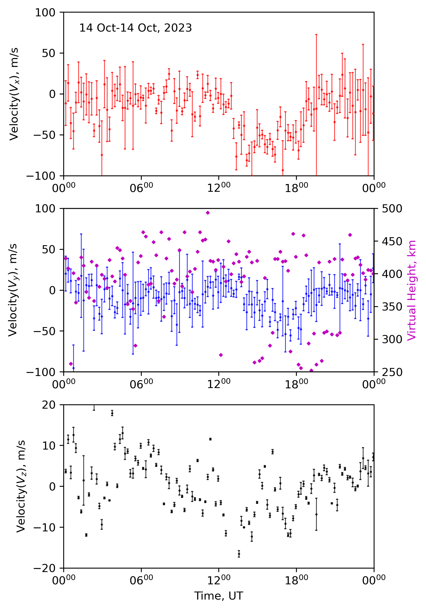

# DIGISONDE Drift Velocity (DVL) Example

This tutorial shows how to transform raw DIGISONDE DVL files into publication-ready
drift velocity plots using `pynasonde`. The example is based on data from the
2023 Great American Annular Eclipse and generates figures that can be embedded
directly into the MkDocs site.

## Why analyze DVL data?

- **Monitor ionospheric dynamics**: DVL products provide horizontal and vertical plasma
  drift velocities, revealing how the ionosphere responds to solar events and geomagnetic storms.
- **Characterize eclipse signatures**: During solar eclipses, plasma dynamics change rapidly.
  Visualizing DVL data helps quantify these variations over the course of the event.
- **Build reproducible workflows**: Automating the analysis ensures that future eclipses or
  campaigns can reuse the same plotting scripts with minimal changes.

## Workflow overview

1. Collect directories containing `.DVL` files and load them with
   `DvlExtractor.load_DVL_files`.
2. Use `SkySummaryPlots.plot_dvl_drift_velocities` to create a stacked plot showing
   drift speed, virtual height, and related diagnostics.
3. Customize time axes, overplot virtual heights, adjust velocity ranges, and save the
   figure to `docs/examples/figures/` for inclusion in the documentation.

## Example script

The code snippet below comes directly from
[`examples/digisonde/dvl.py`](https://githu.com/shibaji7/pynasonde/examples/digisonde/dvl.py). Update the
`data_dirs` list and the baseline `date` to point at your own datasets before running.

```python
"""Example script for documenting DVL (drift velocity) plots in MkDocs.

The recipe:

1. Gather one or more directories containing `.DVL` files and load them with
   `DvlExtractor.load_DVL_files`.
2. Use `SkySummaryPlots.plot_dvl_drift_velocities` to build the stacked drift
   velocity figure.
3. Customize axes (time range, virtual height overlay, etc.), then export the
   plot into `docs/examples/figures/` so it can be embedded directly in the
   generated documentation.

Update the `data_dirs` list and the `date` variable to match your dataset
before running the example.
"""

import datetime as dt
import matplotlib.dates as mdates

from pynasonde.digisonde.digi_plots import SkySummaryPlots
from pynasonde.digisonde.parsers.dvl import DvlExtractor

date = dt.datetime(2023, 10, 14)  # Baseline day for the time-axis window; adjust per dataset.

dvl_df = DvlExtractor.load_DVL_files(  # Collect all DVL records from each directory.
    [
        "/tmp/chakras4/Crucial X9/APEP/AFRL_Digisondes/Digisonde Files/SKYWAVE_DPS4D_2023_10_14/"
    ],
    n_procs=12,
)
dvlplot = SkySummaryPlots.plot_dvl_drift_velocities(  # Generate the stacked drift velocity panels.
    dvl_df, fname=None, draw_local_time=False, figsize=(5, 3)
)
ax = dvlplot.axes[0]
ax.xaxis.set_major_locator(
    mdates.HourLocator(interval=6)
)  # 6-hour ticks along the bottom panel.
ax.set_xlim([date, date + dt.timedelta(1)])  # Highlight a single-day interval.

ax = dvlplot.axes[1]
axt = ax.twinx()  # Overlay virtual height on a secondary axis.
axt.scatter(dvl_df.datetime, 0.5 * (dvl_df.Hb + dvl_df.Ht), marker="D", s=3, color="m")
axt.set_ylabel("Virtual Height, km", fontdict={"color": "m"})
axt.set_ylim(250, 500)
ax.xaxis.set_major_locator(mdates.HourLocator(interval=6))
ax.set_xlim([date, date + dt.timedelta(1)])

ax = dvlplot.axes[2]
ax.set_ylim(-20, 20)  # Symmetric vertical velocity bounds for clarity.
ax = dvlplot.axes[2]
ax.xaxis.set_major_locator(mdates.HourLocator(interval=6))
ax.set_xlim([date, date + dt.timedelta(1)])

dvlplot.save(
    f"docs/examples/figures/stackplots_dvl.png"
)  # Persist figure for documentation reuse.
dvlplot.close()
```

> Adjust the time range, tick spacing, and color/marker styles as needed to match
your campaign. Parallel processing (`n_procs`) speeds up ingestion when loading
large collections of `.DVL` files.

<figure markdown>

<figcaption>Figure: Drift velocity stack plot for the 14 October 2023 Great American Annular Eclipse, highlighting plasma dynamics throughout the day.</figcaption>
</figure>
