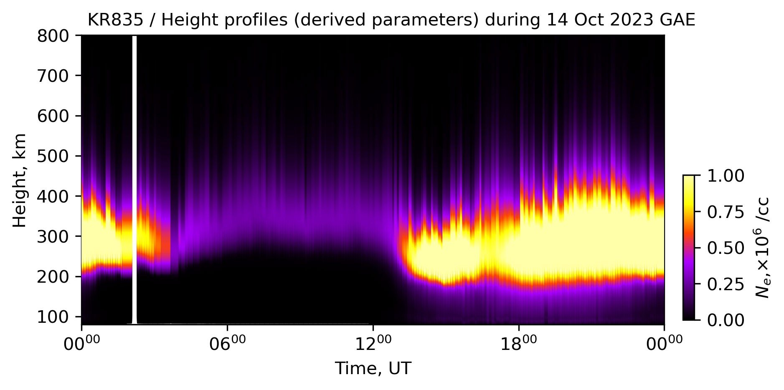
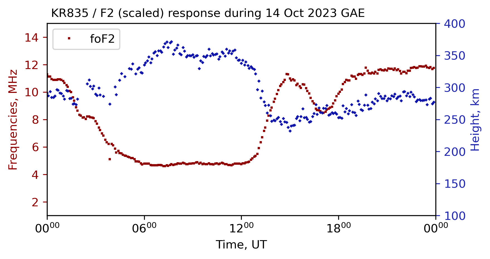

# DIGISONDE SAO (Scaled Ionogram) Example

This tutorial shows how to transform DIGISONDE `.SAO` files into publication-ready
visualizations using `pynasonde`. The walkthrough draws on observations from the
14 October 2023 Great American Annular Eclipse and produces two complementary
figures—electron-density height profiles and F2-layer diagnostics—that can be
embedded directly in the MkDocs documentation. The runnable script lives at
[`examples/digisonde/sao.py`](https://gihub.com/shibaji7/pynasonde/examples/digisonde/sao.py), and the parser
utilities reside in
[`pynasonde/digisonde/parsers/sao.py`](https://gihub.com/shibaji7/pynasonde/pynasonde/digisonde/parsers/sao.py).

## Why analyze SAO products?

- **Track layer evolution**: Height profiles highlight how ionospheric layers rise
  and fall during dynamic events like eclipses.
- **Quantify electron-density trends**: Rescaling electron density clarifies magnitude
  changes over time without sacrificing detail.
- **Monitor critical frequencies**: Plotting `foF2` and `hmF2` together reveals how the
  F2 peak responds to external forcing.
- **Standardize documentation assets**: Exporting plots into the docs tree guarantees
  consistent visuals across campaigns and publications.

## Workflow overview

1. Load one or more directories of `.SAO` files with `SaoExtractor.load_SAO_files`.
2. For height profiles, convert electron density to convenient units before plotting.
3. For scaled products, visualize `foF2` and `hmF2` on dual axes to capture F2-layer
   behavior.
4. Save generated figures to `docs/examples/figures/` for reuse within MkDocs.

## Example script


The listing below mirrors `examples/digisonde/sao.py`. Update the folder paths,
baseline `date`, and figure captions to align with your own datasets. Each section can
run independently if you only need one of the two figure types.

```python
"""MkDocs example illustrating two SAO (scaled ionogram) workflows.

Height-profile panel
--------------------
1. Load one or more `.SAO` directories with `SaoExtractor.load_SAO_files`.
2. Derive electron density (`ed`) profiles and rescale them to 10^6 cm^-3 units.
3. Plot time–height density profiles and save the figure for documentation.

Scaled-parameter panel
----------------------
1. Reload the same files using the `scaled` extractor function.
2. Visualize `foF2` and `hmF2` on dual y-axes to capture F2-layer evolution.
3. Export the plot into `docs/examples/figures/` for MkDocs reuse.

Update the `folders` list and baseline `date` to match your campaign before
running the script.
"""

import datetime as dt
import matplotlib.dates as mdates

from pynasonde.digisonde.digi_plots import SaoSummaryPlots
from pynasonde.digisonde.parsers.sao import SaoExtractor

date = dt.datetime(2023, 10, 14)  # Reference day for constraining the time axis.

# Height-profile view: ingest SAO files and compute electron density profiles.
df = SaoExtractor.load_SAO_files(
    folders=[
        "/tmp/chakras4/Crucial X9/APEP/AFRL_Digisondes/Digisonde Files/SKYWAVE_DPS4D_2023_10_14/"
    ],
    func_name="height_profile",
    n_procs=12,
)

# Convert electron density to units of 10^6 cm^-3 to simplify the colorbar.
df.ed = df.ed / 1e6

sao_plot = SaoSummaryPlots(
    figsize=(6, 3),
    fig_title="KR835 / Height profiles (derived parameters) during 14 Oct 2023 GAE",
    draw_local_time=False,
)
sao_plot.add_TS(
    df,
    zparam="ed",
    prange=[0, 1],
    zparam_lim=10,
    cbar_label=r"$N_e$,$\times 10^{6}$ /cc",
    plot_type="scatter",
    scatter_ms=20,
)

# Tighten the x-axis to a single-day window with 6-hour ticks for readability.
ax = sao_plot.axes
ax.set_xlim([date, date + dt.timedelta(1)])
ax.xaxis.set_major_locator(mdates.HourLocator(interval=6))

# Persist the figure alongside other documentation assets.
sao_plot.save("docs/examples/figures/stack_sao_ne.png")
sao_plot.close()


# F2-layer view: reload the SAO files using the `scaled` product to pull summary parameters.
df = SaoExtractor.load_SAO_files(
    folders=[
        "/tmp/chakras4/Crucial X9/APEP/AFRL_Digisondes/Digisonde Files/SKYWAVE_DPS4D_2023_10_14/"
    ],
    func_name="scaled",
    n_procs=12,
)

sao_plot = SaoSummaryPlots(
    figsize=(6, 3),
    fig_title="KR835 / F2 (scaled) response during 14 Oct 2023 GAE",
    draw_local_time=False,
)

# Plot dual-axis F2 parameters (critical frequency and peak height).
sao_plot.plot_TS(
    df,
    right_yparams=["hmF2"],
    left_yparams=["foF2"],
    right_ylim=[100, 400],
    left_ylim=[1, 15],
)

# Tighten the x-axis to a single-day window with 6-hour ticks for readability.
ax = sao_plot.axes
ax.set_xlim([date, date + dt.timedelta(1)])
ax.xaxis.set_major_locator(mdates.HourLocator(interval=6))

# Persist the figure alongside other documentation assets.
sao_plot.save("docs/examples/figures/stack_sao_F2.png")
sao_plot.close()
```

> Tune color scaling, marker size, and axis limits to emphasize the structures most
relevant to your study. Increasing `n_procs` improves throughput when ingesting large
SAO archives.

<figure markdown>

<figcaption>Figure 01: Electron-density height profiles for the Kirtland station during the 14 October 2023 Great American Annular Eclipse, highlighting the diurnal evolution surrounding the event.</figcaption>
</figure>

<figure markdown>

<figcaption>Figure 02: Dual-axis depiction of `foF2` and `hmF2` from the same day, illustrating how the F2-layer critical frequency and peak height varied throughout the eclipse.</figcaption>
</figure>
