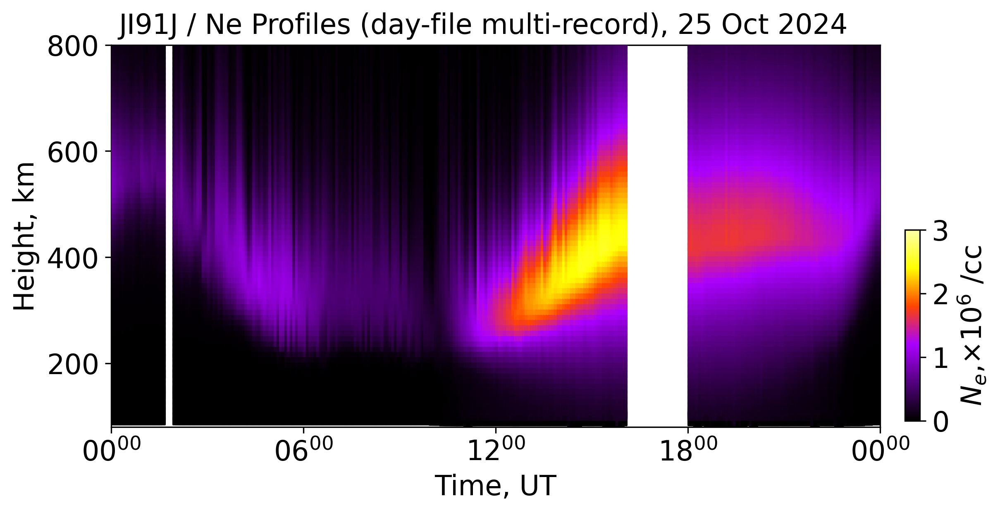
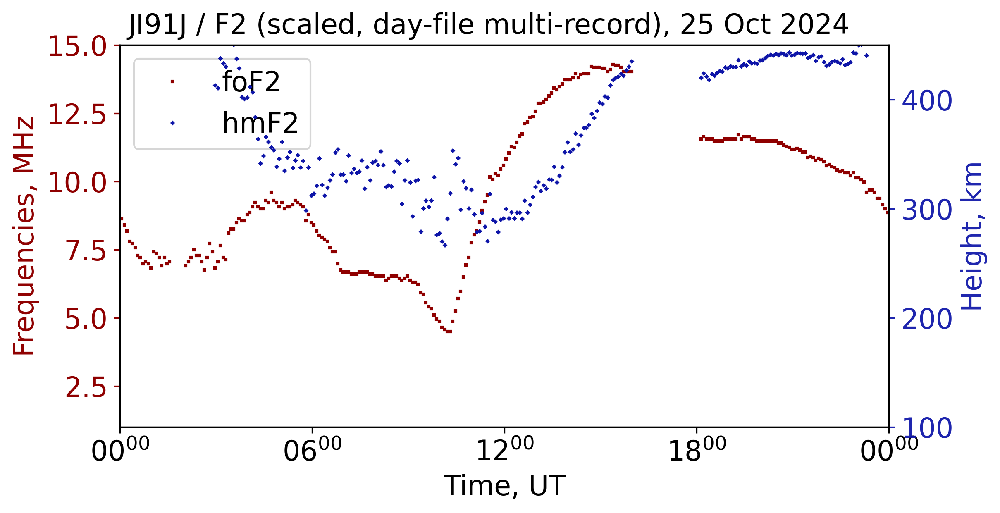

# SAO — Multi-Record Day-File Workflows

<div class="hero">
  <h3>Day-File SAO Workflows</h3>
  <p>
    Load day-style <code>.SAO</code> files in full-day mode, extract
    indexed single scans, and produce multi-panel electron-density and
    F2-parameter time-series figures.
  </p>
</div>

This page explains `examples/digisonde/sao_multi.py`.

Data used: JI91J station, 25 October 2024.

## Call Flow

1. `SaoExtractor.load_SAO_files(..., mode="auto")` loads all records from day
   files and returns a concatenated DataFrame.
2. Pass `func_name="height_profile"` for height vs time panels, or
   `func_name="scaled"` for F2 summary parameters.
3. Pass `mode="single"` with a `record_index` to pull one scan (supports
   negative indices like `-1` for the last scan).
4. `SaoSummaryPlots.add_TS()` renders electron density as a scatter or
   pcolormesh time–height panel.
5. `SaoSummaryPlots.plot_TS()` renders dual-axis foF2 / hmF2 line plots.

## Key Code

### 1) Full-Day Height-Profile Panel

```python
import datetime as dt
import matplotlib.dates as mdates
from pynasonde.digisonde.parsers.sao import SaoExtractor
from pynasonde.digisonde.digi_plots import SaoSummaryPlots

date    = dt.datetime(2024, 10, 25)
folders = ["path/to/day-files/"]

df_hp = SaoExtractor.load_SAO_files(
    folders=folders,
    func_name="height_profile",
    n_procs=12,
    mode="auto",
)
df_hp = df_hp.copy()
df_hp["ed"] = df_hp["ed"] / 1e6   # scale to ×10⁶ cm⁻³

sao_plot = SaoSummaryPlots(figsize=(8, 4),
                           fig_title="JI91J / Ne Profiles 25 Oct 2024")
sao_plot.add_TS(df_hp, zparam="ed", prange=[0, 3], zparam_lim=10,
                cbar_label=r"$N_e$, $\times10^6$ /cc",
                plot_type="scatter", scatter_ms=20)
sao_plot.axes.set_xlim([date, date + dt.timedelta(1)])
sao_plot.axes.xaxis.set_major_locator(mdates.HourLocator(interval=6))
sao_plot.save("docs/examples/figures/stack_sao_multi_ne.png")
sao_plot.close()
```

### 2) Full-Day Scaled F2 Parameters

```python
df_sc = SaoExtractor.load_SAO_files(
    folders=folders, func_name="scaled", n_procs=12, mode="auto"
)

sao_plot = SaoSummaryPlots(figsize=(8, 4),
                           fig_title="JI91J / F2 Scaled 25 Oct 2024")
sao_plot.plot_TS(df_sc,
                 right_yparams=["hmF2"], left_yparams=["foF2"],
                 right_ylim=[100, 450],  left_ylim=[1, 15])
sao_plot.axes.set_xlim([date, date + dt.timedelta(1)])
sao_plot.axes.xaxis.set_major_locator(mdates.HourLocator(interval=6))
sao_plot.save("docs/examples/figures/stack_sao_multi_F2.png")
sao_plot.close()
```

### 3) Single-Scan Indexed Extraction

```python
import pandas as pd

df_sel  = SaoExtractor.load_SAO_files(folders=folders, func_name="scaled",
                                      n_procs=12, mode="single",
                                      record_index=10)
df_last = SaoExtractor.load_SAO_files(folders=folders, func_name="scaled",
                                      n_procs=12, mode="single",
                                      record_index=-1)
df_sel["series"]  = "record_index=10"
df_last["series"] = "record_index=-1 (last)"
df_cmp = pd.concat([df_sel, df_last], ignore_index=True)

sao_plot = SaoSummaryPlots(figsize=(8, 4),
                           fig_title="JI91J / Indexed scans 25 Oct 2024")
sao_plot.plot_TS(df_cmp,
                 right_yparams=["hmF2"], left_yparams=["foF2"],
                 right_ylim=[100, 450],  left_ylim=[1, 15])
sao_plot.save("docs/examples/figures/stack_sao_multi_indexed.png")
sao_plot.close()
```

## Run

```bash
cd /path/to/pynasonde
python examples/digisonde/sao_multi.py
```

## Output Figures

<figure markdown>

<figcaption>Figure 1: Electron-density height profiles for JI91J, 25 Oct 2024 — full-day multi-record mode.</figcaption>
</figure>

<figure markdown>

<figcaption>Figure 2: foF2 and hmF2 scaled parameters from the same day.</figcaption>
</figure>

## Related Files

- `examples/digisonde/sao_multi.py`
- `pynasonde/digisonde/parsers/sao.py`
- `pynasonde/digisonde/digi_plots.py`

## See Also

- [SAO Height Profiles + F2](sao.md)
- [SAO Isodensity + DFT Waterfall](sao_dft.md)
- [SAO API Reference](../../dev/digisonde/parsers/sao.md)
