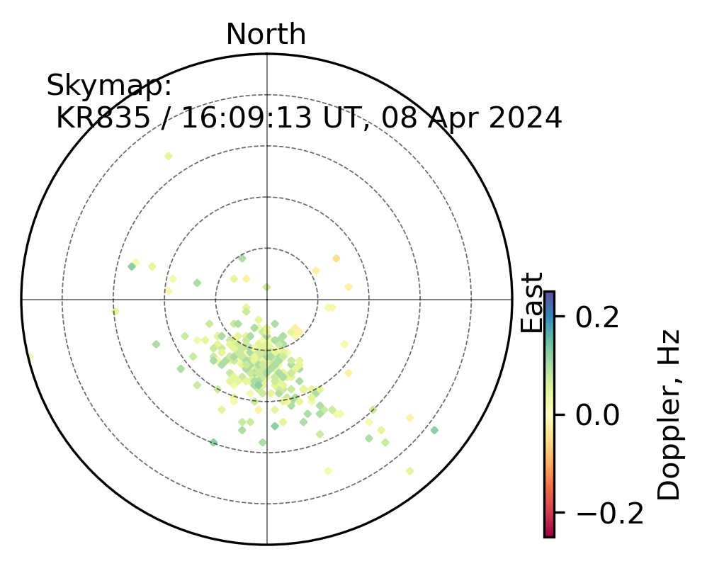

# DIGISONDE Sky Map Example

This tutorial walks through producing sky map visualizations from DIGISONDE
`.SKY` files with `pynasonde`. The example leverages observations from the
08 April 2024 Great American Eclipse and saves figures that can be referenced
directly in the MkDocs documentation. The runnable script lives at
[`examples/digisonde/sky.py`](../../../examples/digisonde/sky.py), and the
parsing utilities it relies on reside in
[`pynasonde/digisonde/parsers/sky.py`](../../../pynasonde/digisonde/parsers/sky.py).

## Why generate sky maps?

- **Visualize propagation geometry**: Track azimuth and elevation coverage to
  diagnose station performance and wave propagation paths.
- **Highlight Doppler dynamics**: Coloring by Doppler frequency emphasizes
  ionospheric motion during events such as eclipses or geomagnetic storms.
- **Enable side-by-side comparisons**: Multi-panel layouts reveal changes
  across stations or time windows within a single figure.

## Workflow overview

1. Instantiate `SkyExtractor` with the target `.SKY` file and optional flags to
   load auxiliary frequency/angle tables.
2. Call `extract()` and convert the parsed structure into a pandas DataFrame
   with `to_pandas()` for visualization.
3. Render sky maps using `SkySummaryPlots`, then save the figures to
   `docs/examples/figures/` for inclusion in MkDocs.

## Example script - for single file

The listing below reproduces the workflow from `examples/digisonde/sky.py`.
Edit the file paths to match your own data prior to execution.

```python
"""MkDocs example illustrating single and multi-panel DIGISONDE sky maps.

The workflow highlights the typical steps:

1. Provide the path to a `.SKY` file when constructing `SkyExtractor`, plus
   flags that enable optional frequency/angle tables.
2. Call `extract` to parse the raw data and convert the result to a pandas
   dataframe via `to_pandas` for plotting or analysis.
3. Use `SkySummaryPlots` to render either a standalone sky map or a multi-panel
   layout, then save the figures to `docs/examples/figures/` so MkDocs can pick
   them up automatically.

Update the sample file path(s) to point at your own data before running the
example; any additional temporary artifacts can be written to a directory of
your choosing.
"""

from pynasonde.digisonde.digi_plots import SkySummaryPlots
from pynasonde.digisonde.parsers.sky import SkyExtractor

# Build a parser instance with a target .SKY file plus flags controlling
# whether auxiliary frequency and angle tables are loaded.
extractor = SkyExtractor(
    "examples/data/KR835_2024099160913.SKY",
    True,
    True,
)
# Trigger the raw read/parsing routine; accessing `.dataset` demonstrates that
# metadata such as the most recent frequency header is now available.
extractor.extract().dataset[-1].freq_headers
# Convert the parsed structure into a tidy dataframe for plotting/pandas work.
df = extractor.to_pandas()
# Instantiate the plot helper that encapsulates matplotlib figure creation.
skyplot = SkySummaryPlots()
# Render a sky map using Doppler frequency as the color surface; adjust limits
# and labels to taste for your dataset.
skyplot.plot_skymap(
    df,
    zparam="spect_dop_freq",
    text=f"Skymap:\n {extractor.stn_code} / {extractor.date.strftime('%H:%M:%S UT, %d %b %Y')}",
    cmap="Spectral",
    clim=[-0.25, 0.25],
    rlim=6,
)
# Persist the figure in the documentation assets directory.
skyplot.save("docs/examples/figures/single_skymap.png")
skyplot.close()
```

> Adjust color limits, radial limits, subplot counts, and annotation text to suit
your investigation. Providing multiple files in the `files` list enables rapid
comparison across time or stations.

<figure markdown>

<figcaption>Figure 01: Single-map output highlighting Doppler frequency shifts observed at Kirtland during the 08 April 2024 Great American Eclipse (16:09 UT).</figcaption>
</figure>

## Example script - for multiple files
> Ideal for contrasting multiple time intervals or stations in a single figure.
```python
# Generate a multi-panel sky map layout for comparative analysis.
import numpy as np
import datetime as dt
import glob

files = sorted(glob.glob("examples/data/KR835_202409916*.SKY"))
skyplot = SkySummaryPlots(
    fig_title="",
    nrows=2,
    ncols=2,
    font_size=15,
    figsize=(4, 4),
    date=dt.datetime(2024, 4, 8, 16),
    date_lims=[dt.datetime(2024, 4, 8, 15), dt.datetime(2024, 4, 8, 18)],
    subplot_kw=dict(projection="polar"),
    draw_local_time=False,
)
for i, f in enumerate(files):
    extractor = SkyExtractor(
        f,
        True,
        True,
    )
    extractor.extract()
    df = extractor.to_pandas()
    # Annotate each panel with the UT timestamp of the observation.
    text = f"{extractor.date.strftime('%H:%M:%S UT')}\n"
    skyplot.plot_skymap(
        df,
        zparam="spect_dop_freq",
        text=text,
        cmap="Spectral",
        clim=[-0.25, 0.25],
        rlim=6,
        cbar=i == len(files) - 1,
    )
ax = skyplot.fig.get_axes()[0]
ax.text(
    -0.1,
    0.99,
    "8 April 2024 GAE analysis",
    ha="left",
    va="top",
    transform=ax.transAxes,
    rotation=90,
)
skyplot.save("docs/examples/figures/panel_skymaps.png")
skyplot.close()
```

<figure markdown>

<figcaption>Figure 02: Multi-panel layout from following script, ideal for contrasting multiple time intervals or stations in a single figure.</figcaption>
</figure>
