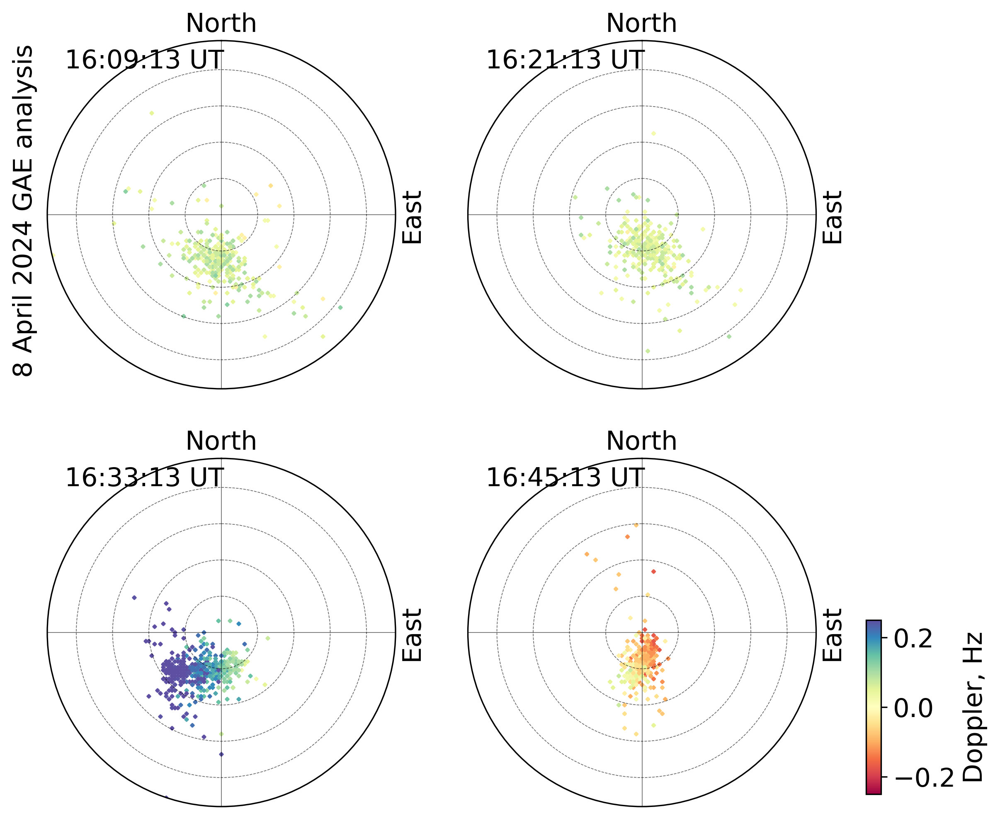

# DIGISONDE Sky Map Example

This example demonstrates the full workflow for turning a DIGISONDE `.SKY`
file into one or more sky map images with `pynasonde`. The runnable script
is available at [`examples/digisonde/sky.py`](https://github.com/shibaji7/pynasonde/examples/digisonde/sky.py),
and the extractor utilities it relies on live in
[`pynasonde/digisonde/parsers/sky.py`](https://github.com/shibaji7/pynasonde/pynasonde/digisonde/parsers/sky.py).

## Workflow overview

1. Instantiate `SkyExtractor` with the path to a `.SKY` file plus any optional
   loader flags (frequency tables, angle tables).
2. Call `extract()` to parse the raw file, then convert the result to a pandas
   DataFrame with `to_pandas()` for analysis and plotting.
3. Use `SkySummaryPlots` to render either a single sky map or a multi-panel
   layout, then save the resulting figures for later use.

## Example script - Single file read and plot

The script below mirrors the version shipped in `examples/digisonde/sky.py`.
It first produces a single sky map image, then shows how to set up a multi-panel
layout for comparative studies.

```python
"""MkDocs example illustrating single and multi-panel DIGISONDE sky maps.

The workflow highlights the typical steps:

1. Provide the path to a `.SKY` file when constructing `SkyExtractor`, plus
   flags that enable optional frequency/angle tables.
2. Call `extract` to parse the raw data and convert the result to a pandas
   dataframe via `to_pandas` for plotting or analysis.
3. Use `SkySummaryPlots` to render either a standalone sky map or a multi-panel
   layout, then save the figures to `docs/examples/figures/` so MkDocs can pick
   them up automatically.

Update the sample file path(s) to point at your own data before running the
example; any additional temporary artifacts can be written to a directory of
your choosing.
"""

from pynasonde.digisonde.digi_plots import SkySummaryPlots
from pynasonde.digisonde.parsers.sky import SkyExtractor

# Build a parser instance with a target .SKY file plus flags controlling
# whether auxiliary frequency and angle tables are loaded.
extractor = SkyExtractor(
    "examples/data/KR835_2024099160913.SKY",
    True,
    True,
)
# Trigger the raw read/parsing routine; accessing `.dataset` demonstrates that
# metadata such as the most recent frequency header is now available.
extractor.extract().dataset[-1].freq_headers
# Convert the parsed structure into a tidy dataframe for plotting/pandas work.
df = extractor.to_pandas()
# Instantiate the plot helper that encapsulates matplotlib figure creation.
skyplot = SkySummaryPlots()
# Render a sky map using Doppler frequency as the color surface; adjust limits
# and labels to taste for your dataset.
skyplot.plot_skymap(
    df,
    zparam="spect_dop_freq",
    text=f"Skymap:\n {extractor.stn_code} / {extractor.date.strftime('%H:%M:%S UT, %d %b %Y')}",
    cmap="Spectral",
    clim=[-0.25, 0.25],
    rlim=6,
)
# Persist the figure in the documentation assets directory.
skyplot.save("docs/examples/figures/single_skymap.png")
skyplot.close()
```

> Tune `clim`, `rlim`, and the `cmap` selection to match the dynamic range of
your dataset. The multi-panel configuration accepts any list of `.SKY` files,
making it easy to compare multiple time intervals or stations in a single view.

<figure markdown>

<figcaption>Figure 01: Output from the single-map portion of the script, showing the Doppler frequency shift during the 08 April 2024 Great American Eclipse, as observed overhead by the Kirtland station at 16:09 UT.</figcaption>
</figure>

## Example script - Multiple file read and plot
> Suitable for comparing multiple files or time intervals on one canvas

```python
# Generate a multi-panel sky map layout for comparative analysis.
import numpy as np
import datetime as dt
import glob

files = sorted(glob.glob("examples/data/KR835_202409916*.SKY"))
skyplot = SkySummaryPlots(
    fig_title="",
    nrows=2,
    ncols=2,
    font_size=15,
    figsize=(4,4),
    date=dt.datetime(2024,4,8,16),
    date_lims=[dt.datetime(2024,4,8,15), dt.datetime(2024,4,8,18)],
    subplot_kw=dict(projection="polar"),
    draw_local_time=False,
)
for i, f in enumerate(files):
    extractor = SkyExtractor(f, True, True,)
    extractor.extract()
    df = extractor.to_pandas()
    # Annotate each panel with the UT timestamp of the observation.
    text=f"{extractor.date.strftime('%H:%M:%S UT')}\n"
    skyplot.plot_skymap(
        df,
        zparam="spect_dop_freq",
        text=text,
        cmap="Spectral",
        clim=[-0.25, 0.25],
        rlim=6,
        cbar=i==len(files)-1,
    )
ax = skyplot.fig.get_axes()[0]
ax.text(-0.1, 0.99, "8 April 2024 GAE analysis", ha="left", va="top", transform=ax.transAxes, rotation=90)
skyplot.save("docs/examples/figures/panel_skymaps.png")
skyplot.close()
```

<figure markdown>

<figcaption>Figure 02: Multi-panel layout produced by the same script, suitable for comparing multiple files or time intervals on one canvas.</figcaption>
</figure>
