# Examples

  <h3>Executable Workflows</h3>
  
Hands-on examples for loading ionosonde data, processing soundings, and producing publication-ready figures.

## DIGISONDE Examples

  

    <strong>DVL — Drift Velocity Stack Plot</strong>
    Load a full day of DPS4D <code>.DVL</code> files in parallel and produce a three-panel stacked drift velocity figure with a virtual-height overlay.
     <a href="digisonde/dvl/">Open Example</a>
  

  

    <strong>SKY — Sky Map Visualization</strong>
    Parse DIGISONDE <code>.SKY</code> files, build single-panel polar sky maps colored by Doppler frequency, and combine multiple soundings into a multi-panel comparison figure.
     <a href="digisonde/sky/">Open Example</a>
  

  

    <strong>SAO — Height Profiles and F2 Diagnostics</strong>
    Extract electron-density height profiles and scaled F2-layer parameters from DPS4D <code>.SAO</code> files; produce time–height and dual-axis line plots.
     <a href="digisonde/sao/">Open Example</a>
  

  

    <strong>SAO + DFT — Isodensity Contours, Doppler Waterfall, and Spectra</strong>
    Build a daily isodensity contour from hundreds of <code>.SAO</code> files, then visualize the Doppler waterfall and per-height spectra from a single <code>.DFT</code> file.
     <a href="digisonde/sao_dft/">Open Example</a>
  

  

    <strong>RSF — Direction-Coded Ionogram and Daily Directogram</strong>
    Parse raw DPS4D <code>.RSF</code> sounding files, render a direction-coded ionogram for a single record, and stack a full day into a directogram (time vs. ground distance).
     <a href="digisonde/rsf_direction_ionogram/">Open Example</a>
  

  

    <strong>RSF — Parse and Inspect Raw Sounding File</strong>
    Low-level walkthrough: load a single <code>.RSF</code> file, parse all blocks and frequency groups into structured Python dataclasses, and inspect headers programmatically.
     <a href="digisonde/rsf/">Open Example</a>
  

## VIPIR Examples

  

    <strong>RIQ — Ionogram from Raw Capture</strong>
    Read a VIPIR <code>.RIQ</code> file, clean the ionogram with the adaptive gain filter, and plot O/X-mode power on a frequency–virtual-height canvas.
     <a href="vipir/proc_riq/">Open Example</a>
  

  

    <strong>NGI — Frequency–Time Interval (FTI) Plot</strong>
    Load a day of VIPIR NGI ionogram cubes in parallel, flatten per-band power grids into a long-form dataframe, and produce O-mode FTI stacked panels.
     <a href="vipir/fti/">Open Example</a>
  

  

    <strong>NGI — AutoScaler Sanity-Check Figures</strong>
    Stage a day of NGI files, run the full autoscaling pipeline (median filter → image segmentation → Otsu + DBSCAN binary traces), and emit a QA sanity-check figure.
     <a href="vipir/scale_module/">Open Example</a>
  

## Figure Gallery

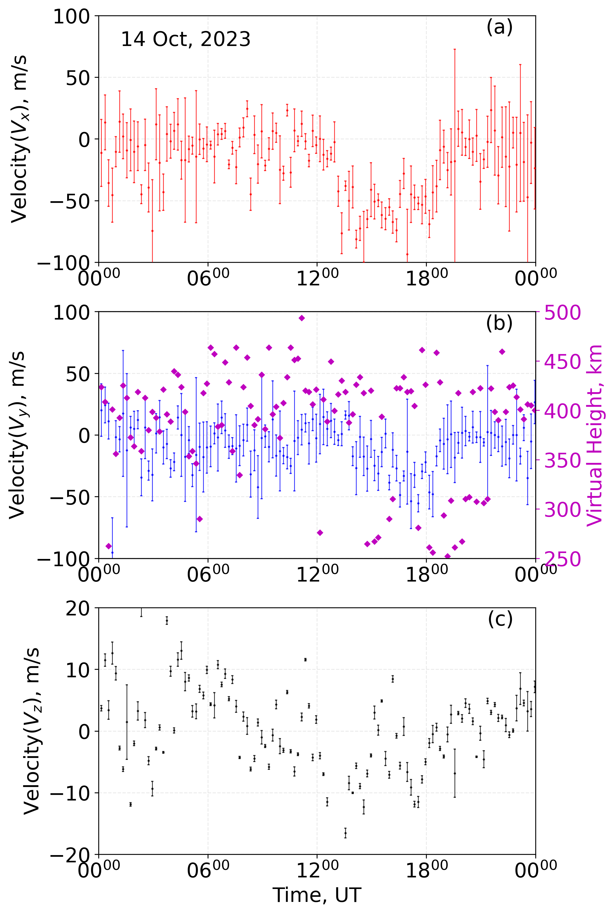
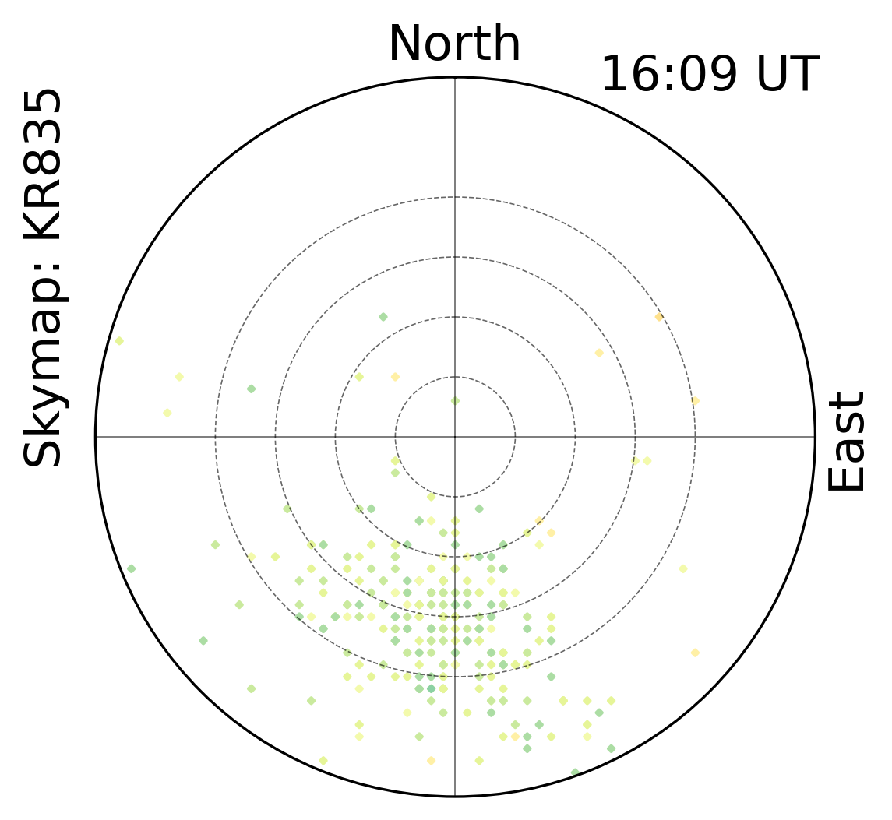
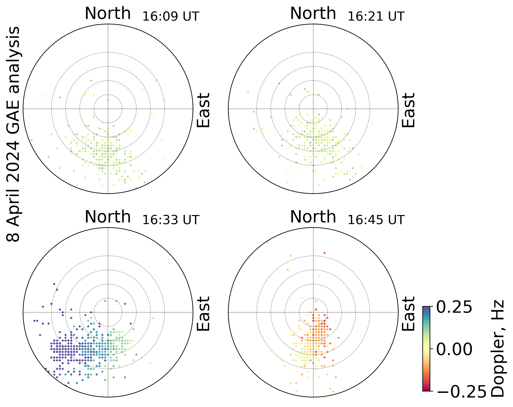
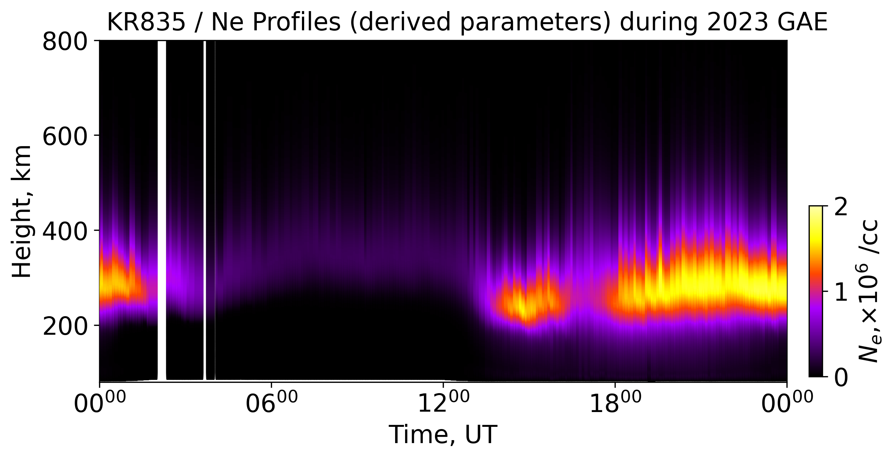
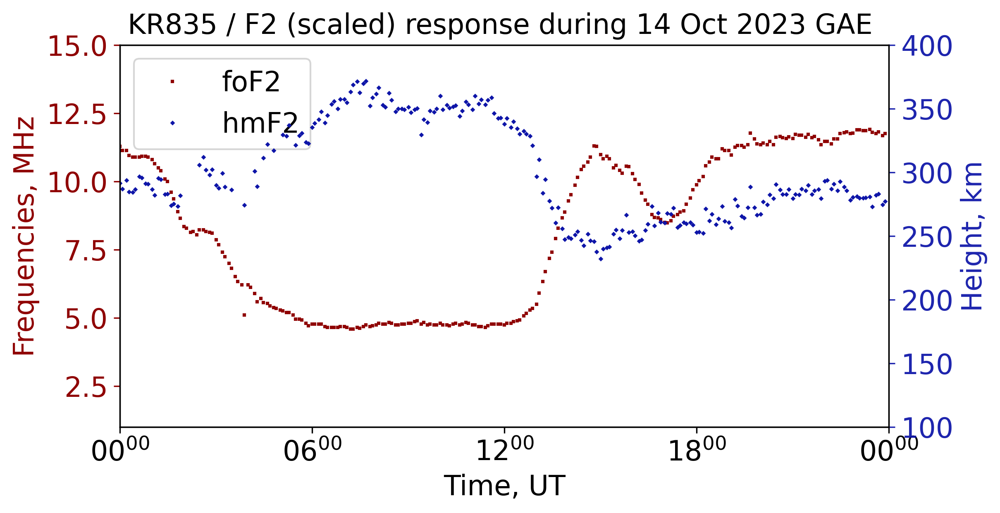
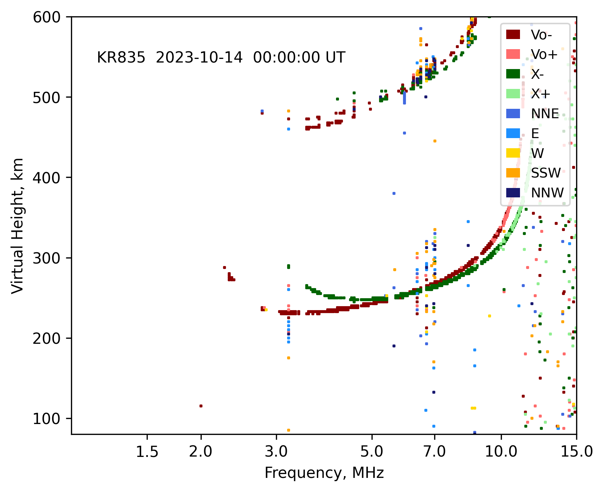
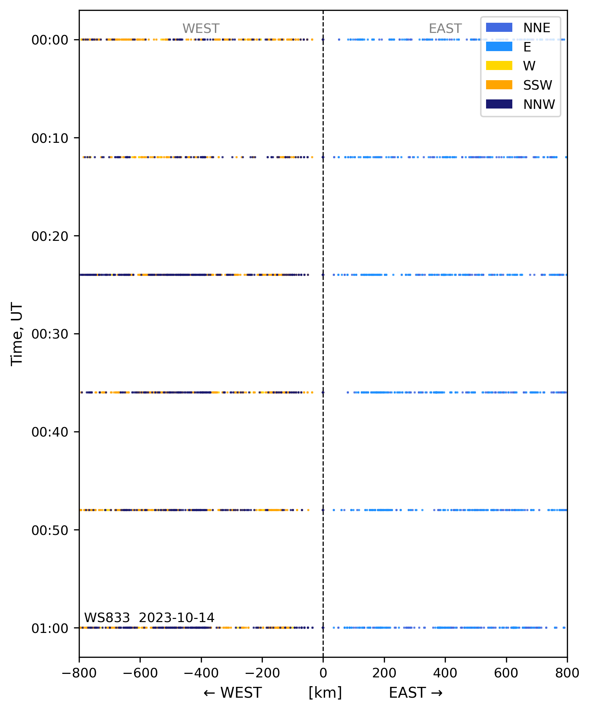
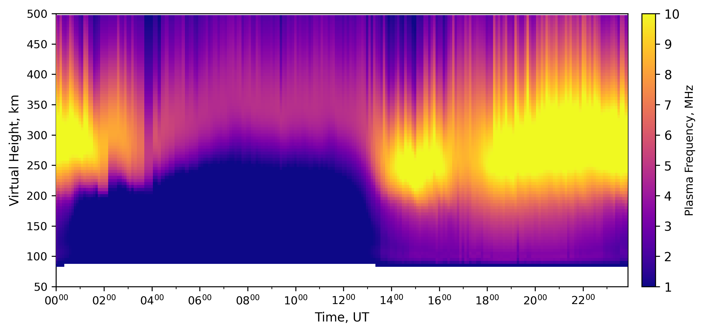
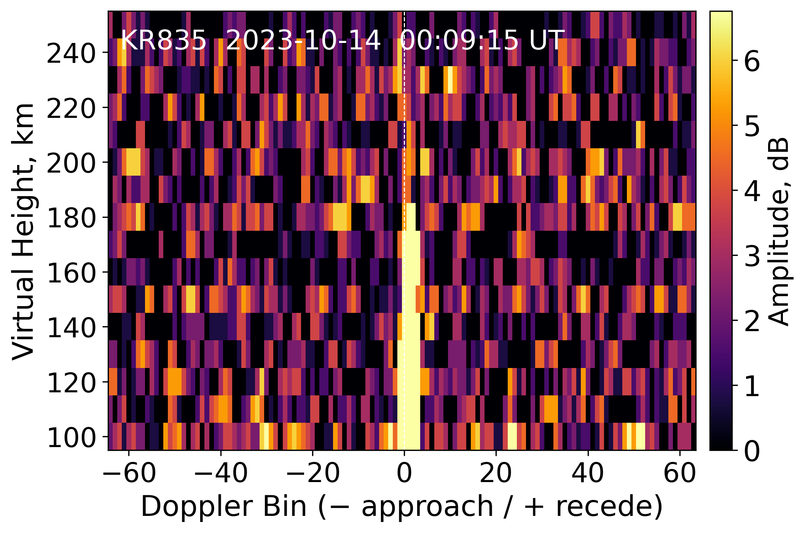
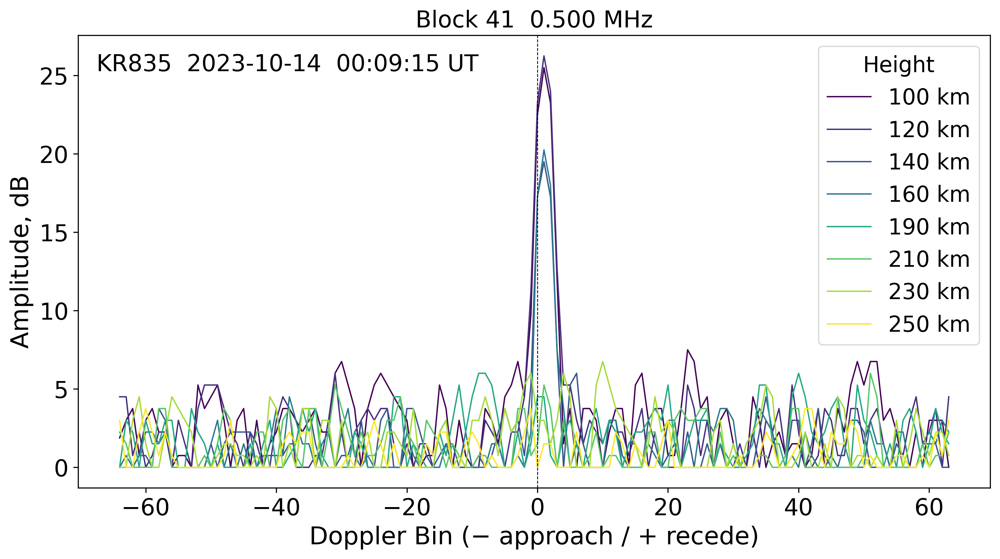
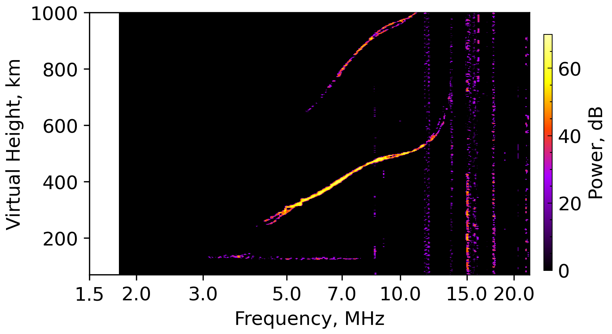
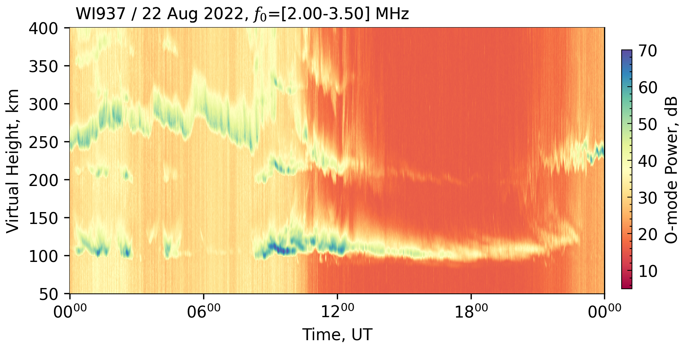
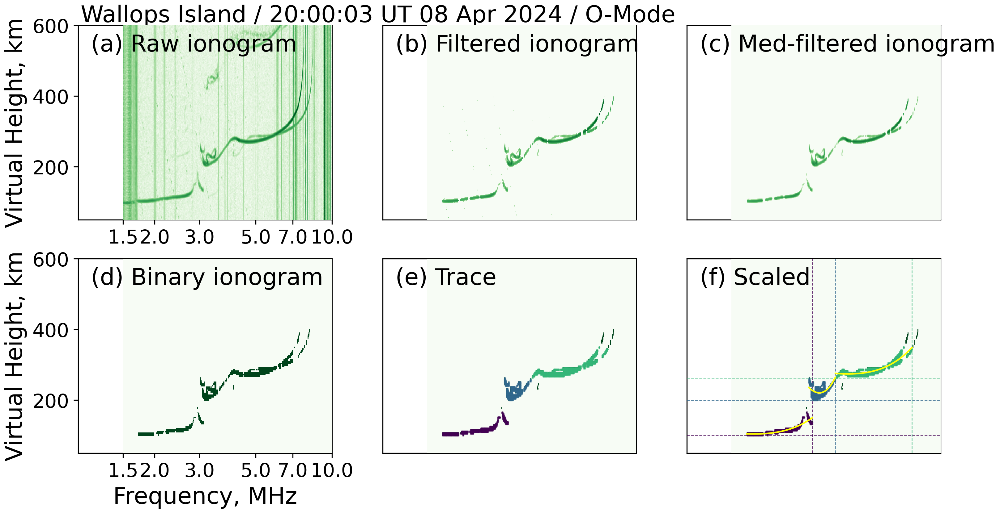
