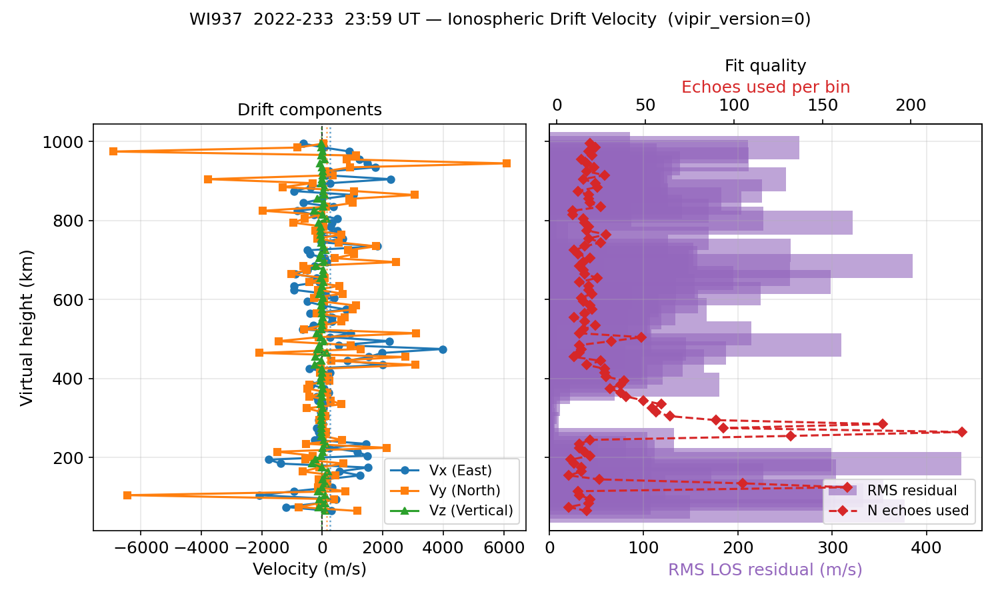

# Drift Velocity — WI937

<div class="hero">
  <h3>3-D Ionospheric Drift Velocity from a VIPIR RIQ File</h3>
  <p>
    Estimate the full <strong>[Vx, Vy, Vz]</strong> drift vector from
    line-of-sight velocity measurements extracted by
    <code>EchoExtractor</code>, using height-binned weighted least-squares
    with iterative sigma-clipping.
  </p>
</div>

**Script**: `examples/vipir/drift_velocity_wi937.py`

---

## Physics background

Each ionospheric echo returns one line-of-sight (LOS) velocity measurement:

$$
V^*_i = l_i \, V_x + m_i \, V_y + n_i \, V_z
$$

The direction cosines are computed from the echo's own echolocation
parameters (XL, YL, virtual height R′):

$$
l = \frac{X_L}{R'} \quad (\text{East}), \qquad
m = \frac{Y_L}{R'} \quad (\text{North}), \qquad
n = \sqrt{1 - l^2 - m^2} \quad (\text{Up})
$$

Stacking many echoes with geometrically diverse arrival directions gives
the overdetermined system **A v = V\*** which is solved by weighted
least-squares.  Iterative sigma-clipping removes echoes whose LOS
velocity is inconsistent with the bulk solution.

---

## Steps

### 1 — Load and extract echoes

```python
from pynasonde.vipir.riq.echo import EchoExtractor
from pynasonde.vipir.riq.parsers.read_riq import VIPIR_VERSION_MAP, RiqDataset

riq = RiqDataset.create_from_file(
    "examples/data/WI937_2022233235902.RIQ",
    unicode="latin-1",
    vipir_config=VIPIR_VERSION_MAP.configs[1],  # vipir_version=0 / data_type=1
)

extractor = EchoExtractor(
    sct=riq.sct,
    pulsets=riq.pulsets,
    snr_threshold_db=3.0,
    min_height_km=60.0,
    max_height_km=1000.0,
    min_rx_for_direction=3,
    max_echoes_per_pulset=5,
)
extractor.extract()
```

`min_rx_for_direction=3` ensures XL, YL (and therefore direction cosines)
are available.  WI937 has 8 receivers so this is always satisfied.

---

### 2 — Whole-sounding fit

```python
df_whole = extractor.fit_drift_velocity(
    height_bin_km=None,   # single fit over all echoes
    min_echoes=6,
    snr_weight=True,
    n_sigma=2.5,
    max_ep_deg=None,      # skip EP pre-filter
)
```

`height_bin_km=None` produces one row with the bulk [Vx, Vy, Vz] for the
entire sounding — useful as a sanity check before height-resolved analysis.

Sample output:

```
=== Whole-sounding drift velocity ===
  Vx =  +32.4 m/s  (East)
  Vy =  -18.7 m/s  (North)
  Vz =   -5.1 m/s  (Vertical)
  RMS LOS residual :  41.3 m/s
  Condition number :   6.2
  Echoes used      :  312  (rejected: 24)
```

---

### 3 — Height-binned fit

```python
df_bins = extractor.fit_drift_velocity(
    height_bin_km=10.0,   # 10 km bins
    min_echoes=6,
    snr_weight=True,
    n_sigma=2.5,
    max_ep_deg=None,
)
```

Returns one row per height bin that had ≥ `min_echoes` valid echoes with
finite XL/YL/V\*.

Output columns:

| Column | Description |
|--------|-------------|
| `height_bin_km` | Bin centre altitude (km) |
| `vx_mps` | East component (m/s) |
| `vy_mps` | North component (m/s) |
| `vz_mps` | Vertical component (m/s) |
| `residual_mps` | Mean absolute LOS residual after sigma-clipping |
| `condition_number` | Condition number of the weighted design matrix |
| `n_echoes` | Echoes used in the final fit |
| `n_rejected` | Echoes removed by sigma-clipping |

---

### 4 — Output figure

A 2-panel figure is saved to `docs/examples/figures/drift_velocity_wi937.png`:

| Panel | Contents |
|-------|----------|
| **(A)** Drift components vs height | Vx (blue), Vy (orange), Vz (green) as lines; dotted verticals show the whole-sounding estimate |
| **(B)** Fit quality vs height | RMS LOS residual (bar, purple) + echo count per bin (line, red) on dual x-axes |

<figure markdown>

<figcaption>
WI937 2022-233 23:59 UT.  Height-binned drift velocity (10 km bins) with
whole-sounding estimates shown as dotted verticals.
</figcaption>
</figure>

---

## Run

```bash
cd /home/chakras4/Research/CodeBase/pynasonde
python examples/vipir/drift_velocity_wi937.py
```

---

## Notes

- **Condition number**: values above ~50 indicate near-singular geometry
  (echoes all arriving from similar directions).  Discard those bins for
  Vx/Vy and trust only Vz.
- **`snr_weight=True`**: echoes with higher SNR contribute more to the
  fit; useful when the echo cloud has a wide dynamic range.
- **`n_sigma=2.5`**: controls sigma-clipping aggressiveness.  Lower values
  (e.g. 2.0) remove more outliers but risk rejecting legitimate oblique
  echoes in disturbed conditions.
- For a direct comparison of raw vs. filtered drift velocity see
  [Full Analysis — WI937](ionogram_full_analysis_wi937.md).

---

## Related

- [Echo Extraction — WI937](echo_extraction_wi937.md)
- [Ionogram Filter](ionogram_filter.md)
- [Full Analysis — WI937](ionogram_full_analysis_wi937.md)
- `pynasonde/vipir/riq/echo.py` — `EchoExtractor.fit_drift_velocity()`
