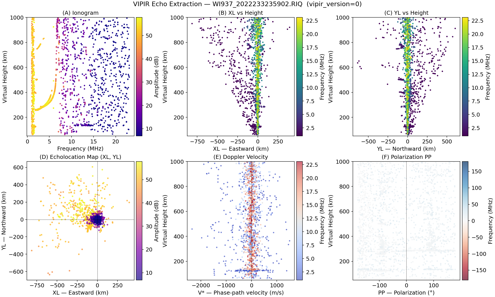

# Echo Extraction — WI937 (Wallops Island, older VIPIR format)

<div class="hero">
  <h3>Dynasonde-Style Seven-Parameter Analysis — VIPIR Version 0</h3>
  <p>
    Load a VIPIR <code>.RIQ</code> binary file recorded by the WI937 sounder
    at Wallops Island (2022) using the older <code>vipir_version=0</code>
    format, run the seven-parameter echo extractor, and produce a 2×3
    diagnostic figure.
  </p>
</div>

This page explains `examples/vipir/echo_extraction_wi937.py`.

!!! note "How this example differs from the PL407 example"
    | Aspect | PL407 (2024) | WI937 (2022) |
    |--------|-------------|-------------|
    | `vipir_config` | `configs[0]` | `configs[1]` |
    | `vipir_version` | 1 | 0 |
    | `data_type` | 2 | 1 |
    | Frequency sweep | linear step | logarithmic step |
    | Ionogram x-axis | linear | **log scale** |

    The only code change needed to switch formats is the `vipir_config`
    argument to `RiqDataset.create_from_file()`.  All echo-extraction and
    plotting logic is identical.

---

## Call Flow

```
RiqDataset.create_from_file(fname, vipir_config=VIPIR_VERSION_MAP.configs[1])
    └─ sct       — frequency schedule uses log_step (fractional)
    └─ pulsets   — one Pulset per frequency step

EchoExtractor(sct, pulsets, snr_threshold_db=3.0)
    .extract()
           │
    ┌──────┴───────┐
    ▼              ▼
.to_dataframe()  .to_xarray()
```

---

## Step-by-Step

### 1 — Load the WI937 RIQ file

```python
from pynasonde.vipir.riq.parsers.read_riq import VIPIR_VERSION_MAP, RiqDataset

riq = RiqDataset.create_from_file(
    "examples/data/WI937_2022233235902.RIQ",
    unicode="latin-1",
    vipir_config=VIPIR_VERSION_MAP.configs[1],   # version 0, data_type=1
)

# Inspect the frequency schedule
print(riq.sct.frequency.base_start)   # start frequency (kHz)
print(riq.sct.frequency.base_end)     # end frequency (kHz)
print(riq.sct.frequency.log_step)     # fractional log step (e.g. 0.05 = 5%)
print(riq.sct.frequency.linear_step)  # 0 when purely log-stepped
```

The `configs[1]` entry in `config.toml` sets `vipir_version=0` and
`data_type=1`, which tells the parser to read I/Q samples as
single-precision floats using the older interleaved layout.

### 2 — Run EchoExtractor

```python
from pynasonde.vipir.riq.echo import EchoExtractor

extractor = EchoExtractor(
    sct=riq.sct,
    pulsets=riq.pulsets,
    snr_threshold_db=3.0,
    min_rx_for_direction=3,
    max_echoes_per_pulset=5,
)
extractor.extract()
```

The extractor API is identical regardless of VIPIR version — only the file
loading step changes.

### 3 — Export and inspect

```python
df = extractor.to_dataframe()
ds = extractor.to_xarray()

# NaN-fraction diagnostic
for col in ("xl_km", "yl_km", "polarization_deg", "residual_deg"):
    n_nan = df[col].isna().sum()
    valid = len(df) - n_nan
    print(f"  {col:20s}: {valid}/{len(df)} valid ({100*valid/len(df):.0f}%)")
```

### 4 — Ionogram on a log frequency axis

Because WI937 uses a logarithmic frequency sweep the sounding frequencies
are spaced evenly in log space, not linear space.  The ionogram panel
therefore uses a log x-axis:

```python
ax.set_xscale("log")
```

This keeps frequency steps visually uniform, exactly as they were
transmitted.  The PL407 linear-sweep example uses a linear x-axis.

---

## Diagnostic figure panels

| Panel | Contents | X-axis | Y-axis | Colour |
|-------|----------|--------|--------|--------|
| **(A)** Ionogram | All echoes | Frequency MHz (log) | Virtual height km | Amplitude dB |
| **(B)** XL vs Height | Eastward echoes | XL km | Virtual height km | Frequency MHz |
| **(C)** YL vs Height | Northward echoes | YL km | Virtual height km | Frequency MHz |
| **(D)** Echolocation map | XL vs YL | XL km | YL km | Amplitude dB |
| **(E)** Doppler velocity | V* profile | V* m s⁻¹ | Virtual height km | Frequency MHz |
| **(F)** Polarization | PP profile | PP ° | Virtual height km | Frequency MHz |

---

## VIPIR version map

`config.toml` defines two entries under `[[vipir_data_format_maps.configs]]`:

```toml
[[vipir_data_format_maps.configs]]
vipir_version = 1          # configs[0] — newer format (PL407, 2024)
data_type     = 2
np_format     = "float32"

[[vipir_data_format_maps.configs]]
vipir_version = 0          # configs[1] — older format (WI937, 2022)
data_type     = 1
np_format     = "float32"
```

Pass the correct entry via the `vipir_config` argument:

```python
# Newer files (data_type=2)
riq = RiqDataset.create_from_file(fname, vipir_config=VIPIR_VERSION_MAP.configs[0])

# Older files (data_type=1)
riq = RiqDataset.create_from_file(fname, vipir_config=VIPIR_VERSION_MAP.configs[1])
```

---

## Run

```bash
cd /home/chakras4/Research/CodeBase/pynasonde
python examples/vipir/echo_extraction_wi937.py
```

## Output figure

<figure markdown>

<figcaption>
2×3 diagnostic figure for WI937 2022-08-21 23:59 UT.
Panel A uses a log frequency axis matching the instrument's logarithmic
sweep schedule.
</figcaption>
</figure>

## Related Files

- `examples/vipir/echo_extraction_wi937.py`
- `examples/vipir/echo_extraction.py` — PL407 counterpart (linear sweep)
- `pynasonde/vipir/riq/echo.py` — `Echo`, `EchoExtractor`
- `pynasonde/vipir/riq/parsers/read_riq.py` — `RiqDataset`, `VIPIR_VERSION_MAP`
- `pynasonde/config.toml` — version map entries

## See Also

- [Echo Extraction — PL407](echo_extraction.md)
- [Echo Extractor API](../../dev/vipir/riq/echo.md)
- [Read/Plot RIQ](proc_riq.md)
