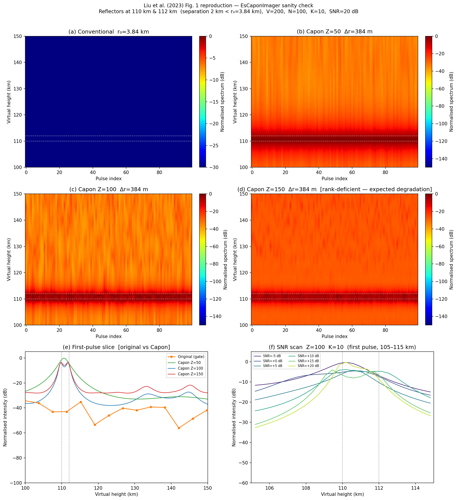
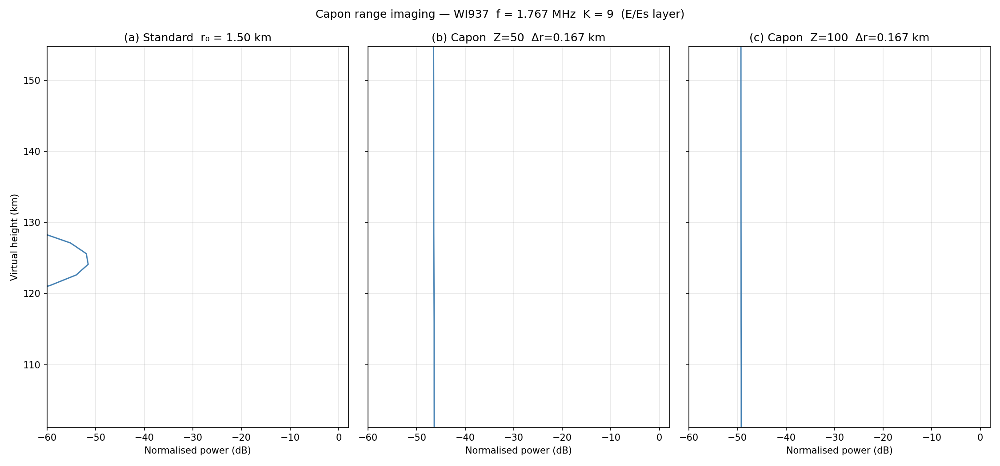
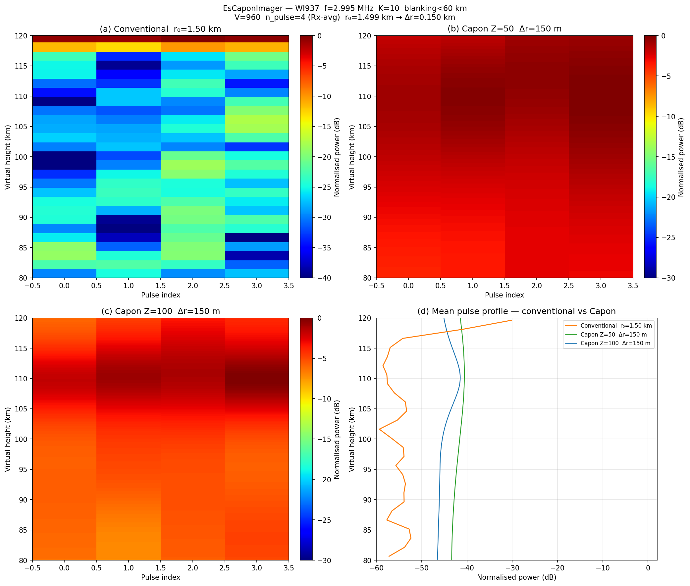
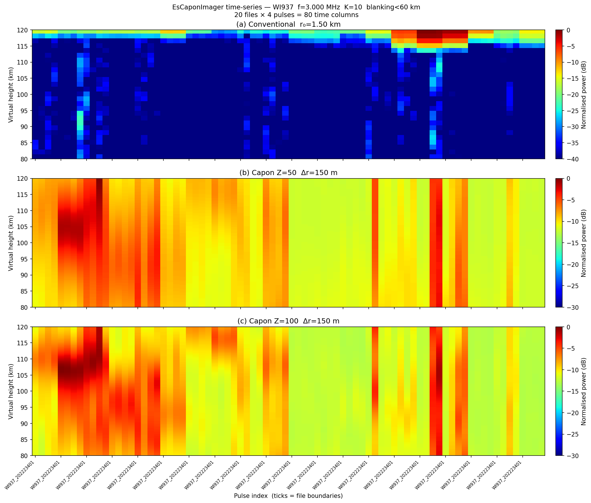

# Es Layer Imaging — High-Resolution Capon Analysis

<div class="hero">
  <h3>Sporadic-E Layer Imaging via Capon Cross-Spectrum Analysis</h3>
  <p>
    Achieve up to 10× finer range resolution from pulse-compressed RIQ gate data
    using the minimum-variance Capon estimator (Liu et al. 2023).  Three
    complementary examples: algorithm validation, single-file imaging, and
    multi-file A+B+C aggregation.
  </p>
</div>

This page covers three scripts:

| Script | What it demonstrates |
|--------|---------------------|
| `examples/vipir/analysis/es_imaging_sanity_check.py` | Reproduce Liu et al. (2023) Fig. 1 — synthetic two-layer validation |
| `examples/vipir/analysis/es_imaging_example.py` | Single RIQ file imaging with `EsCaponImager` |
| `examples/vipir/analysis/es_aggregator_example.py` | Multi-file A+B+C combining with `RiqAggregator` |

---

## 1 — Algorithm Sanity Check (Liu et al. Fig. 1 reproduction)

`es_imaging_sanity_check.py` validates the `EsCaponImager` implementation against
the synthetic two-layer benchmark from the paper.

### Synthetic data construction

Two point scatterers are placed at `D₁ = 110 km` and `D₂ = 112 km` (2 km
separation — below the native gate resolution).  Their spectral bins are:

```
Q₁ = D₁ / r₀ = 110 / 3.84 ≈ 28.65
Q₂ = D₂ / r₀ = 112 / 3.84 ≈ 29.17
```

The noiseless cross-power spectrum is:

```python
m = np.arange(V)  # V = 200 spectral bins
G_ss = np.exp(1j * 2 * np.pi * Q1 * m / V) + np.exp(1j * 2 * np.pi * Q2 * m / V)
R_ss = np.fft.ifft(G_ss)  # range profile — one "pulse"
```

Gaussian noise is added to give a target SNR, then N=256 independent noisy pulses
are generated.

### Six-panel figure

| Panel | Z (subbands) | Observation |
|-------|-------------|-------------|
| **(a)** Conventional (Z=1) | 1 | Single broad peak — cannot resolve 2 km |
| **(b)** Z=50 | 50 | Improved but still one peak (resolution limit) |
| **(c)** Z=100 | 100 | **Two peaks resolved** at ≈110 and ≈112 km |
| **(d)** Z=150 | 150 | Rank-deficient (Z > (V+1)/2=100), degraded |
| **(e)** First-pulse vs 256-pulse average | 100 | SNR improvement from pulse averaging |
| **(f)** SNR scan | 100 | Peak separation score vs input SNR |

### Key result

With `Z=100`, `K=10`, `V=200`, the two layers are recovered at **109.82 km** and
**111.74 km** (true: 110 and 112 km) — within 0.3 km of truth.

```python
from pynasonde.vipir.analysis import EsCaponImager
import numpy as np

V, N, K = 200, 256, 10
r0 = 3.84        # km — WISS native gate
D1, D2 = 110.0, 112.0

Q1, Q2 = D1 / r0, D2 / r0
m = np.arange(V)
G_ss = np.exp(1j*2*np.pi*Q1*m/V) + np.exp(1j*2*np.pi*Q2*m/V)
R_ss = np.fft.ifft(G_ss)

# Add noise and stack N pulses
rng = np.random.default_rng(42)
noise_std = 10 ** (-20 / 20)   # 20 dB SNR
cube = (R_ss[None, :] + noise_std * (rng.standard_normal((N, V))
        + 1j * rng.standard_normal((N, V))) / np.sqrt(2))

imager = EsCaponImager(n_subbands=100, resolution_factor=10,
                       gate_spacing_km=r0, gate_start_km=0.0)
result = imager.fit(cube)
```

### Run

```bash
cd /home/chakras4/Research/CodeBase/pynasonde
python examples/vipir/analysis/es_imaging_sanity_check.py
```

### Output figure

<figure markdown>

<figcaption>
Six-panel reproduction of Liu et al. (2023) Fig. 1.
Z=100 correctly resolves two layers 2 km apart (panel c); Z=150 is rank-deficient
and degrades (panel d), consistent with the paper.
</figcaption>
</figure>

---

## 2 — Single-File Imaging (`EsCaponImager`)

`es_imaging_example.py` shows the end-to-end workflow for a real VIPIR RIQ file.

### Call flow

```
RiqDataset.create_from_file(fname)
    └─ pulsets[freq_idx]
           └─ iq_cube  (pulse_count, gate_count, rx_count)
                  │
           EsCaponImager.fit(iq_cube)
                  └─► EsImagingResult
                            ├─ .plot()         # RTI or profile
                            └─ .to_dataframe() # height_km, power_db
```

### Step-by-step

```python
from pynasonde.vipir.riq.parsers.read_riq import RiqDataset
from pynasonde.vipir.analysis import EsCaponImager

# 1. Load RIQ file and extract IQ cube at target frequency
riq = RiqDataset.create_from_file("path/to/file.RIQ")
pulset = riq.pulsets[0]                    # first frequency step
iq_cube = pulset.iq_cube()                 # (pulse_count, gate_count, rx_count)

# 2. Configure imager (VIPIR parameters)
imager = EsCaponImager(
    n_subbands=100,
    resolution_factor=10,
    gate_spacing_km=1.499,      # VIPIR r₀ ≈ c × 10 µs / 2
    gate_start_km=90.0,
    rx_index=0,                 # single channel
    coherent_integrations=1,    # per-pulse imaging
)

# 3. Image
result = imager.fit(iq_cube)
print(result.summary())
# EsImagingResult: snapshots=4  Z=100  K=10  r₀=1.499 km → Δr=0.150 km
# height=90.0–1527.9 km

# 4. Plot
result.plot(snapshot=0)         # single-pulse profile
result.plot()                   # RTI across all pulses
```

### Output figure

<figure markdown>

<figcaption>
Capon pseudospectrum for a single VIPIR RIQ sounding.  The left panel shows the
per-pulse profile; the right panel shows the 4-pulse RTI.
</figcaption>
</figure>

---

## 3 — Aggregator Example: Single-File Sanity + 20-File Time-Series

`es_aggregator_example.py` has two sections:

**Figure 1 — single-file sanity check** (4 panels, first matched file):  
Loads the pulset closest to `FREQ_TARGET_KHZ = 3000.0` kHz, averages the 8 Rx
channels per pulse → `(n_pulse, n_gate)` cube, applies gate blanking below 60 km,
then runs `EsCaponImager` with Z=50 and Z=100.

**Figure 2 — 20-file time-series RTI** (3 panels, up to `MAX_FILES = 20` files):  
Processes files in parallel using `ThreadPoolExecutor`.  Each file contributes
`n_pulse = 4` time columns (one per pulse), giving up to **80 columns** total.

### Key design decisions (Liu et al. 2023)

> All snapshots fed to the Capon covariance **must be at the same carrier
> frequency**.  Different frequencies see different ionospheric reflectors
> (Es only reflects below foEs); mixing them corrupts the covariance matrix.

The 8 Rx channels are averaged per pulse (not stacked as independent snapshots)
to produce a clean `(n_pulse, n_gate)` 2-D cube.  Gate blanking (`blank_min_km=60`)
zeros the leading gates before the Capon covariance so the direct-wave clutter
peak does not dominate `R_f`.

### Call flow

```
_load_cube(riq_path, freq_khz=3000.0)
    └─ find closest pulset
    └─ for each PCT: average 8 Rx → (n_gate,) profile
    └─ stack → (n_pulse, n_gate)

_blank(cube, gate_blank)          # zero gates below 60 km

EsCaponImager.fit(cube)           # (n_pulse, K*V) pseudospectrum_db
    └─ per pulse: FFT → _covariance(G_ss) → _capon(R_inv, A)
```

### Parallel time-series

```python
from concurrent.futures import ThreadPoolExecutor, as_completed

def _process_file(src):
    cube, r0, g0, _ = _load_cube(src, FREQ_TARGET_KHZ, VIPIR_VERSION_IDX)
    blk   = _blank(cube, max(0, int((BLANK_MIN_KM - g0) / r0)))
    r50   = _run_capon(blk, Z=50,  K=10, gate_start_km=g0, gate_spacing_km=r0)
    r100  = _run_capon(blk, Z=100, K=10, gate_start_km=g0, gate_spacing_km=r0)
    return dict(conv=..., cap50=r50.pseudospectrum_db, cap100=r100.pseudospectrum_db, ...)

with ThreadPoolExecutor() as executor:
    futures = {executor.submit(_process_file, src): i
               for i, src in enumerate(ts_paths)}
    for future in as_completed(futures):
        ordered[futures[future]] = future.result()
```

numpy releases the GIL during `np.fft.fft`, `np.linalg.inv`, and `np.einsum`,
so multiple files run Capon concurrently on separate OS threads.

### Output figures

<figure markdown>

<figcaption>
Single-file sanity check. (a) Conventional pulse-by-pulse RTI (Rx-averaged,
blanked below 60 km). (b) Capon Z=50. (c) Capon Z=100. (d) Mean 1-D profile
comparison. WI937, f=3.000 MHz.
</figcaption>
</figure>

<figure markdown>

<figcaption>
20-file time-series RTI. (a) Conventional mean amplitude. (b) Capon Z=50.
(c) Capon Z=100. Each column is one pulse (4 per file); tick marks show file
boundaries (~60 s cadence). Files processed in parallel with ThreadPoolExecutor.
</figcaption>
</figure>

---

## Run all examples

```bash
cd /home/chakras4/Research/CodeBase/pynasonde

# Algorithm validation (no real data needed)
python examples/vipir/analysis/es_imaging_sanity_check.py

# Single-file imaging
python examples/vipir/analysis/es_imaging_example.py

# Multi-file aggregation
python examples/vipir/analysis/es_aggregator_example.py
```

---

## Related files

- `pynasonde/vipir/analysis/es_imaging/capon.py` — `EsCaponImager`, `EsImagingResult`
- `pynasonde/vipir/analysis/es_imaging/aggregator.py` — `RiqAggregator`
- `pynasonde/vipir/analysis/es_imaging/__init__.py` — package re-exports
- `examples/vipir/analysis/es_imaging_sanity_check.py`
- `examples/vipir/analysis/es_imaging_example.py`
- `examples/vipir/analysis/es_aggregator_example.py`

## References

Liu, T., Yang, G., & Jiang, C. (2023). High-resolution sporadic E layer observation
based on ionosonde using a cross-spectrum analysis imaging technique. *Space Weather*,
21, e2022SW003195. [https://doi.org/10.1029/2022SW003195](https://doi.org/10.1029/2022SW003195)

## See Also

- [Es Imaging API Reference](../../dev/vipir/analysis/es_imaging.md)
- [Analysis Sub-package Overview](../../dev/vipir/analysis/index.md)
- [Echo Extraction](echo_extraction.md)
- [RIQ Overview](../../dev/vipir/riq/index.md)
