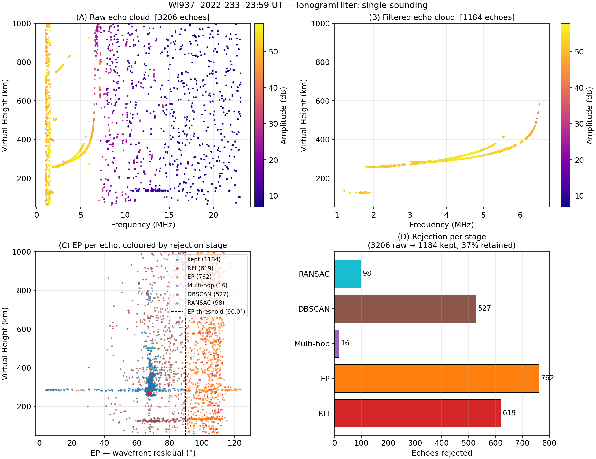
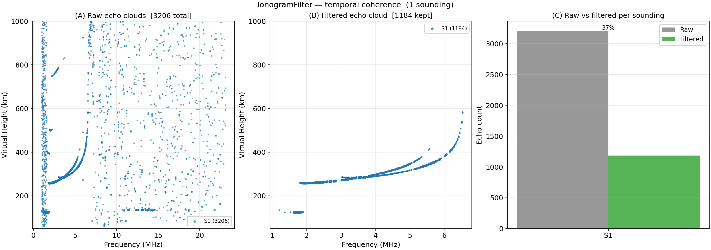

# Ionogram Filter — Coherent Echo Cleaning

<div class="hero">
  <h3>Six-Stage Post-Extraction Noise Rejection</h3>
  <p>
    Apply <code>IonogramFilter</code> to a VIPIR RIQ echo cloud to remove RFI,
    non-planar wavefront returns, multi-hop ground echoes, and isolated noise —
    with optional temporal coherence enforcement across multiple soundings.
  </p>
</div>

Two example scripts are provided:

| Script | Description |
|--------|-------------|
| `examples/vipir/ionogram_filter_wi937.py` | Single WI937 sounding — stages 1–5 |
| `examples/vipir/ionogram_filter_pl407.py` | Single PL407 sounding — stages 1–5 (n_rx=2, no EP/XL/YL) |
| `examples/vipir/ionogram_filter_multi.py` | Multiple PL407 soundings — stages 1–6 including temporal coherence |

---

## Filter stages

```
Echo cloud (EchoExtractor.to_dataframe())
         │
         ▼
  Stage 1 — RFI blanking
         │  Remove frequencies where echo height IQR > rfi_height_iqr_km
         ▼
  Stage 2 — EP filter
         │  Reject echoes with EP (wavefront residual) > ep_max_deg
         ▼
  Stage 3 — Multi-hop removal
         │  Flag 2F / 3F echoes at N×h*(1F) that are ≥ snr_margin_db weaker
         ▼
  Stage 4 — DBSCAN noise rejection
         │  Cluster in (f, h, V*, A, EP) space; label −1 = noise
         ▼
  Stage 5 — RANSAC trace fitting
         │  Fit polynomial h*(f); reject echoes > ransac_residual_km from curve
         ▼
  Stage 6 — Temporal coherence  ← multi-sounding only
         │  Keep (f, h) cells populated in ≥ temporal_min_soundings soundings
         ▼
  Filtered DataFrame
```

---

## Example 1 — Single sounding (WI937)

**Script**: `examples/vipir/ionogram_filter_wi937.py`

### Steps

#### 1 — Load and extract

```python
from pynasonde.vipir.riq.echo import EchoExtractor
from pynasonde.vipir.riq.parsers.read_riq import VIPIR_VERSION_MAP, RiqDataset

riq = RiqDataset.create_from_file(
    "examples/data/WI937_2022233235902.RIQ",
    unicode="latin-1",
    vipir_config=VIPIR_VERSION_MAP.configs[1],
)
ext = EchoExtractor(
    sct=riq.sct, pulsets=riq.pulsets,
    snr_threshold_db=3.0,
    min_height_km=60.0,
    max_height_km=1000.0,
).extract()
```

#### 2 — Configure and run the filter

```python
from pynasonde.vipir.riq.parsers.filter import IonogramFilter

filt = IonogramFilter(
    rfi_enabled=True,       rfi_height_iqr_km=300.0,
    ep_filter_enabled=True, ep_max_deg=90.0,
    multihop_enabled=True,  multihop_orders=(2, 3), multihop_snr_margin_db=6.0,
    dbscan_enabled=True,    dbscan_eps=1.0, dbscan_min_samples=5,
    ransac_enabled=True,    ransac_residual_km=100.0,
    temporal_enabled=False,   # single sounding — stage 6 skipped automatically
)

df_clean = filt.filter(ext)
print(filt.summary())
```

Sample output:

```
Stage         Input  Rejected  Kept   Retention
─────────────────────────────────────────────────
RFI            3206        12  3194     99.6 %
EP             3194       281  2913     91.2 %
Multi-hop      2913        87  2826     97.0 %
DBSCAN         2826       179  2647     93.7 %
─────────────────────────────────────────────────
Total          3206       559  2647     82.6 %
```

### Output figure panels

| Panel | Contents |
|-------|----------|
| **(A)** Raw ionogram | Echo cloud before filtering |
| **(B)** Filtered ionogram | Echo cloud after all 4 stages |
| **(C)** EP vs height | Each echo coloured by which stage rejected it |
| **(D)** Rejection bar chart | Count of echoes removed per stage |

<figure markdown>

<figcaption>
WI937 2022-08-21 23:59 UT.  3206 raw echoes → 2647 after filtering (83 % retained).
</figcaption>
</figure>

### Run

```bash
cd /home/chakras4/Research/CodeBase/pynasonde
python examples/vipir/ionogram_filter_wi937.py
```

---

## Example 2 — Single sounding (PL407)

**Script**: `examples/vipir/ionogram_filter_pl407.py`

PL407 uses `vipir_version=1` / `data_type=2` (`configs[0]`) and has only 2 receivers,
so XL, YL, and EP are all NaN.  DBSCAN omits `residual_deg`; stages 1–5 apply.

```python
filt = IonogramFilter(
    rfi_height_iqr_km=300.0,
    ep_max_deg=90.0,           # no-op (EP all NaN for PL407)
    dbscan_features=(
        "frequency_khz", "height_km",
        "velocity_mps", "amplitude_db",
        # residual_deg omitted — entirely NaN for n_rx=2
    ),
    temporal_enabled=False,
)
```

---

## Example 3 — Multiple soundings (temporal coherence)

**Script**: `examples/vipir/ionogram_filter_multi.py`

Add more consecutive RIQ files to the `fnames` list:

```python
fnames = [
    "examples/data/PL407_2024058061501.RIQ",
    # "examples/data/PL407_2024058062001.RIQ",   # add consecutive soundings
    # "examples/data/PL407_2024058062501.RIQ",
    # "examples/data/PL407_2024058063001.RIQ",
    # "examples/data/PL407_2024058063501.RIQ",
]
```

Stage 6 (temporal coherence) activates automatically when `len(extractors) > 1`:

```python
filt = IonogramFilter(
    temporal_enabled=True,
    temporal_min_soundings=3,       # cell must appear in ≥ 3 soundings
    temporal_freq_bin_khz=50.0,
    temporal_height_bin_km=50.0,
)

df_clean = filt.filter(extractors)  # list of EchoExtractor objects
# "sounding_index" column distinguishes soundings in the output DataFrame
```

### How temporal coherence works

```
cell(f, h) = (round(f / 50 kHz), round(h / 50 km))

for each sounding i:
    mark all cells present in sounding i

occupancy(cell) = number of soundings containing that cell

keep echo  ←→  occupancy(cell) >= temporal_min_soundings
```

Real echoes follow the ionospheric trace and appear in the same (f, h) cell
across consecutive soundings.  Noise hits are random and rarely repeat.

### Output figure panels

| Panel | Contents |
|-------|----------|
| **(A)** Stacked raw clouds | All soundings overlaid, one colour per sounding |
| **(B)** Filtered cloud | Temporally coherent echoes only |
| **(C)** Per-sounding counts | Bar chart of raw vs filtered echo count per sounding |

<figure markdown>

<figcaption>
Five consecutive WI937 soundings.  Temporal coherence (stage 5) removes
isolated noise hits that survived stages 1–4.
</figcaption>
</figure>

### Run

```bash
cd /home/chakras4/Research/CodeBase/pynasonde
python examples/vipir/ionogram_filter_multi.py
```

---

## Tuning guide

### RFI height-spread threshold

`rfi_height_iqr_km=300.0` is a good starting point.  Ionospheric echoes cluster
tightly in height (IQR < 150 km); RFI scatters across all gates (IQR > 300 km).
Tighten to 150–200 km for low-noise environments; loosen for spread-F conditions
where the real trace can have a naturally elevated IQR.

### RANSAC trace fitting

`ransac_residual_km=100.0` is generous and tolerates spread-F.  Reduce to 50 km
to enforce a tight single-layer trace.  Increase `ransac_n_iter` (e.g. 500) or
`ransac_min_inlier_fraction` (e.g. 0.5) for noisier soundings.

### EP threshold

`ep_max_deg=90.0` is a conservative default that passes oblique real echoes
(which routinely reach 50–80°).  Lower to 45° for strict planar-wavefront quality;
raise above 90° only to disable the stage.  For instruments with n_rx < 3 (e.g.
PL407), EP is NaN and this stage is automatically a no-op.

### DBSCAN parameters

`dbscan_eps=1.0` means echoes must be within ≈ 1 IQR of each other in every
feature dimension to be neighbours.  Increase for sparser soundings; decrease
for dense echo clouds where noise clusters are easily distinguished.

`dbscan_min_samples=5` sets the minimum cluster size.  Reducing to 3 retains
smaller clusters (weaker real echoes) at the cost of more noise surviving.

### Temporal coherence bin size

Larger bins (`temporal_freq_bin_khz=100`, `temporal_height_bin_km=100`)
capture echoes that drift slightly between soundings; smaller bins enforce
stricter consistency.

---

## Related

- [IonogramFilter API](../../dev/vipir/riq/parsers/filter.md)
- [Echo Extraction — WI937](echo_extraction_wi937.md)
- [Drift Velocity Example](drift_velocity_wi937.md)
- `pynasonde/vipir/riq/parsers/filter.py`
