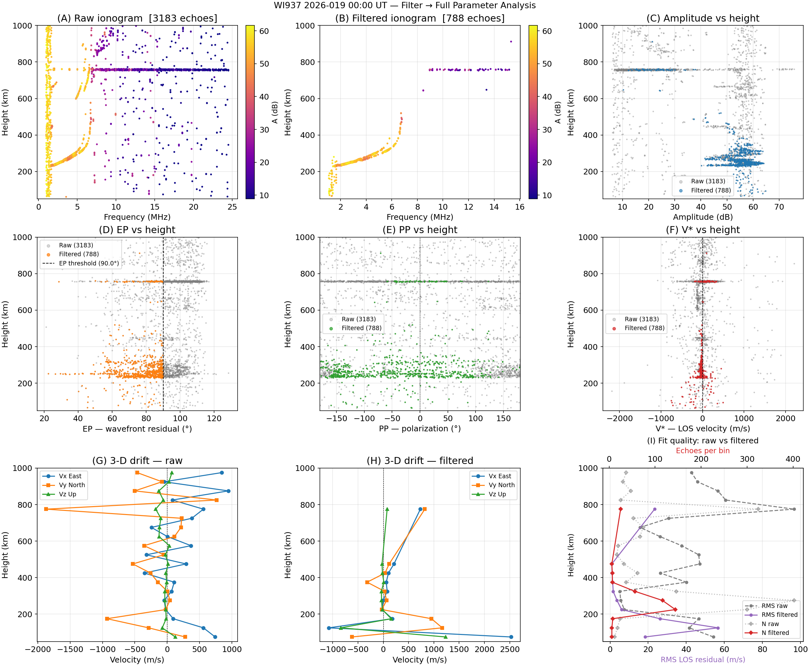

# Full Parameter Analysis — WI937

<div class="hero">
  <h3>Filter → Echo Parameters → 3-D Drift Velocity</h3>
  <p>
    End-to-end diagnostic workflow: load a WI937 RIQ sounding, apply the
    six-stage <code>IonogramFilter</code>, then compute and compare all
    Dynasonde parameters (amplitude, EP, PP, V*) and 3-D drift velocity
    [Vx, Vy, Vz] between raw and filtered echo clouds.
  </p>
</div>

**Script**: `examples/vipir/ionogram_full_analysis_wi937.py`

---

## Pipeline overview

```
WI937_2022233235902.RIQ
        │
        ▼
  EchoExtractor          →  df_raw  (all echoes)
        │
        ▼
  IonogramFilter         →  df_filt (noise-rejected echoes)
  (stages 1–5, temporal skipped)
        │
        ├──► fit_drift_from_df(df_raw)   →  df_vel_raw
        └──► fit_drift_from_df(df_filt)  →  df_vel_filt
                                                │
                                                ▼
                                     3×3 diagnostic figure
```

---

## Steps

### 1 — Load and extract echoes

```python
from pynasonde.vipir.riq.echo import EchoExtractor
from pynasonde.vipir.riq.parsers.read_riq import VIPIR_VERSION_MAP, RiqDataset

riq = RiqDataset.create_from_file(
    "examples/data/WI937_2022233235902.RIQ",
    unicode="latin-1",
    vipir_config=VIPIR_VERSION_MAP.configs[1],  # vipir_version=0 / data_type=1
)

extractor = EchoExtractor(
    sct=riq.sct, pulsets=riq.pulsets,
    snr_threshold_db=3.0,
    min_height_km=60.0,
    max_height_km=1000.0,
    min_rx_for_direction=3,
    max_echoes_per_pulset=5,
)
extractor.extract()
df_raw = extractor.to_dataframe()
```

---

### 2 — Filter (stages 1–5)

```python
from pynasonde.vipir.riq.parsers.filter import IonogramFilter

filt = IonogramFilter(
    rfi_enabled=True,       rfi_height_iqr_km=300.0,  rfi_min_echoes=3,
    ep_filter_enabled=True, ep_max_deg=90.0,
    multihop_enabled=True,  multihop_orders=(2, 3),
    multihop_height_tol_km=50.0, multihop_snr_margin_db=6.0,
    dbscan_enabled=True,    dbscan_eps=1.0, dbscan_min_samples=5,
    dbscan_features=(
        "frequency_khz", "height_km",
        "velocity_mps", "amplitude_db", "residual_deg",
    ),
    ransac_enabled=True,    ransac_residual_km=100.0,
    ransac_min_samples=10,  ransac_n_iter=200,
    ransac_poly_degree=3,   ransac_min_inlier_fraction=0.3,
    temporal_enabled=False,
)

df_filt = filt.filter(extractor)
print(filt.summary())
```

---

### 3 — Height-binned drift velocity (raw and filtered)

The script includes a standalone `fit_drift_from_df()` helper that operates
directly on a DataFrame rather than an `EchoExtractor` object — useful when
comparing pre- and post-filter echo sets without re-extracting:

```python
df_vel_raw  = fit_drift_from_df(df_raw,  height_bin_km=50.0)
df_vel_filt = fit_drift_from_df(df_filt, height_bin_km=50.0)
```

`fit_drift_from_df()` parameters:

| Parameter | Default | Description |
|-----------|---------|-------------|
| `height_bin_km` | `50.0` | Bin width (km) |
| `min_echoes` | `6` | Minimum echoes required per bin |
| `snr_weight` | `True` | SNR-weighted least-squares |
| `n_sigma` | `2.5` | Sigma-clipping threshold |

---

### 4 — Output figure (3×3)

Saved to `docs/examples/figures/ionogram_full_analysis_wi937.png`:

| Panel | Contents |
|-------|----------|
| **(A)** Raw ionogram | Frequency vs height, amplitude colourmap |
| **(B)** Filtered ionogram | Same axes after noise rejection |
| **(C)** Amplitude vs height | Grey = raw, blue = filtered |
| **(D)** EP vs height | Grey = raw, orange = filtered; dashed vertical at EP threshold |
| **(E)** PP (polarization) vs height | Grey = raw, green = filtered |
| **(F)** V\* (LOS velocity) vs height | Grey = raw, red = filtered |
| **(G)** Vx/Vy/Vz vs height — raw | Three-component drift from unfiltered echoes |
| **(H)** Vx/Vy/Vz vs height — filtered | Three-component drift from filtered echoes |
| **(I)** Fit quality: raw vs filtered | RMS LOS residual and echo count per bin, dual x-axes |

<figure markdown>

<figcaption>
WI937 2022-233 23:59 UT.  3×3 diagnostic comparing raw (grey) and
filtered (coloured) echo parameters and the resulting 3-D drift velocity.
</figcaption>
</figure>

---

## Run

```bash
cd /home/chakras4/Research/CodeBase/pynasonde
python examples/vipir/ionogram_full_analysis_wi937.py
```

---

## Key observations

- **Panels A vs B**: the filtered ionogram retains the coherent F-layer
  trace while removing diffuse scatter above the MUF and low-height clutter.
- **Panels D (EP)**: the EP filter (`ep_max_deg=90°`) removes only strongly
  non-planar returns; most oblique echoes (EP 50–80°) are preserved.
- **Panels G vs H**: filtering tightens the height-resolved drift estimates
  — the RMS LOS residual (panel I) drops substantially in height ranges
  dominated by multi-hop or RFI contamination.

---

## Related

- [Ionogram Filter](ionogram_filter.md) — detailed description of all six stages
- [Drift Velocity — WI937](drift_velocity_wi937.md) — dedicated drift-only workflow
- [Echo Extraction — WI937](echo_extraction_wi937.md)
- `pynasonde/vipir/riq/parsers/filter.py` — `IonogramFilter`
- `pynasonde/vipir/riq/echo.py` — `EchoExtractor`
