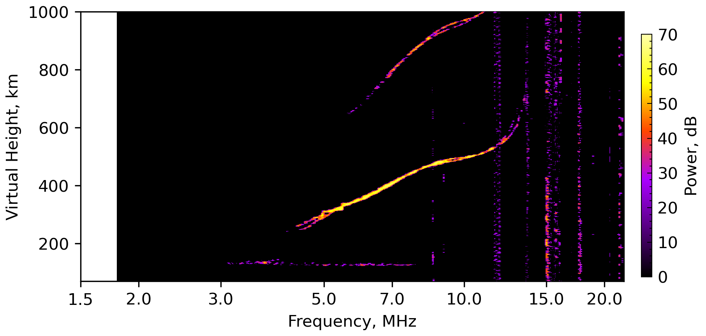

# VIPIR RIQ Ionogram Example

This tutorial shows how to read a VIPIR `.RIQ` capture, clean the ionogram with the
adaptive gain filter, and publish the result as a figure for the documentation. The
walkthrough uses the sample file distributed with `pynasonde`, but the same steps apply
to any RIQ dataset collected by a VIPIR sounder. The runnable script is located at
[`examples/vipir/proc_riq.py`](https://githu.com/shibaji7/pynasonde/examples/vipir/proc_riq.py), and parser utilities
reside in [`pynasonde/vipir/riq/parsers/read_riq.py`](https://githu.com/shibaji7/pynasonde/pynasonde/vipir/riq/parsers/read_riq.py).

## Why process RIQ ionograms?

- **Noise-controlled visualization**: Adaptive filtering removes baseline and impulsive
  noise, producing cleaner ionograms for interpretation or publication.
- **Consistent documentation assets**: Saving figures directly into the docs folder keeps
  tutorials reproducible and shareable.
- **Foundation for advanced analysis**: Parsed ionograms can be fed into feature
  extraction routines or comparison studies with SAO/DVL products.

## Workflow overview

1. Instantiate `RiqDataset` with the proper VIPIR configuration and encoding.
2. Generate an ionogram and clean it with `adaptive_gain_filter`, optionally applying a
   median filter.
3. Plot the filtered ionogram via `Ionogram` and export the figure to
   `docs/examples/figures/`.

## Example script

The following snippet mirrors `examples/vipir/proc_riq.py`. Update `fname` to reference
your own RIQ file and tweak plotting limits as needed.

```python
"""Example script for converting VIPIR RIQ files into ionogram plots for MkDocs.

Steps covered:

1. Load a `.RIQ` file with `RiqDataset.create_from_file`, applying the correct VIPIR
   configuration and character encoding.
2. Apply the adaptive gain filter (baseline removal + optional median filter) to clean
   the raw ionogram.
3. Plot the resulting ionogram with `Ionogram` and save the figure into
   `docs/examples/figures/` so the documentation can embed the output.

Update `fname` to point at your own RIQ capture before running the example.
"""

import numpy as np

from pynasonde.vipir.ngi.plotlib import Ionogram
from pynasonde.vipir.riq.parsers.read_riq import (
    VIPIR_VERSION_MAP,
    RiqDataset,
    adaptive_gain_filter,
)

# Path to the RIQ file to visualize; replace with your own VIPIR dataset.
fname = "examples/data/PL407_2024058061501.RIQ"

# Create a dataset object using the appropriate VIPIR configuration/encoding.
riq = RiqDataset.create_from_file(
    fname,
    unicode="latin-1",
    vipir_config=VIPIR_VERSION_MAP.configs[0],
)

# Generate an ionogram and suppress background noise via adaptive gain + median filter.
ion = adaptive_gain_filter(
    riq.get_ionogram(threshold=50, remove_baseline_noise=True),
    apply_median_filter=True,
    median_filter_size=3,
)

# Replace NaNs introduced by filtering with zero power for stable plotting.
ion.powerdB[np.isnan(ion.powerdB)] = 0.0

# Set up a single-panel ionogram canvas.
p = Ionogram(ncols=1, nrows=1)

# Render the ionogram using power (dB) as the color surface.
p.add_ionogram(
    frequency=ion.frequency,
    height=ion.height,
    value=ion.powerdB,
    mode="O/X",
    xlabel="Frequency, MHz",
    ylabel="Virtual Height, km",
    ylim=[70, 1000],
    xlim=[1.8, 22],
    add_cbar=True,
    cbar_label="Power, dB",
    prange=[0, 70],
    del_ticks=False,
)

# Persist the figure for inclusion in the documentation; adjust path as needed.
p.save("docs/examples/figures/ionogram_from_riq.png")
p.close()
```

> Adjust thresholding, median filter settings, or plotting limits to highlight the
> features most relevant to your campaign. For batch processing, wrap the workflow in a
> loop over multiple RIQ files and assign unique output filenames.

<figure markdown>

<figcaption>Figure: Power-scaled ionogram derived from `PL407_2024058061501.RIQ`, filtered with the adaptive gain procedure to suppress baseline noise.</figcaption>
</figure>
