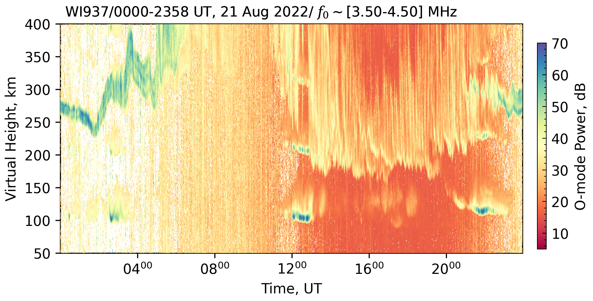

<!-- 
Author(s): Shibaji Chakraborty

Disclaimer:

-->
# Range-Time Interval Plots
This function provides a powerful mechanism for targeted analysis of ionospheric data by allowing users to isolate specific frequency and range windows of interest for a chosen propagation mode (O or X). The implications are significant for research and monitoring: scientists can efficiently extract and visualize relevant signal characteristics (power and noise) from large datasets, facilitating the study of specific ionospheric phenomena, tracking layer movements, or assessing radio communication conditions within defined parameters. By automating the data filtering, processing, and visualization steps, it streamlines the workflow for identifying trends, disturbances, or features like Sporadic E layers or F-region traces within the ionosphere.

<figure markdown>

<figcaption>Figure 01: This RTI plot from station WI937 on August 21, 2022, displays O-mode power dynamics across a full day within the specific frequency range of 3.50-4.50 MHz.

The F-region shows typical diurnal variations: during nighttime hours (approx. 00:00-06:00 UT and 19:00-23:58 UT), reflections are observed at virtual heights generally between 250-350 km, exhibiting a gradual descent post-midnight and ascent pre-dawn, with some undulations visible. During daytime, the selected low frequencies (3.50-4.50 MHz) are significantly affected by D and E region absorption; consequently, the F-region trace is either completely absorbed or the reflections are from the bottomside of the F-layer, appearing as a broad, strong signal band (intense reds and yellows) extending from lower E-region heights up to around 200-250 km. The upper edge of this daytime band likely represents the height at which these specific frequencies are reflected or completely absorbed, rather than the F2 peak itself.

The E-region (~90-150 km) is evident during daytime, particularly between 10:00-20:00 UT, with strong echoes (reddish hues) around 100-125 km.

Notably, distinct Sporadic E (Es) layers are clearly visible. A prominent Es event occurs around 12:00-13:00 UT, appearing as a thin, intense layer (indicated by dark blue/purple colors representing very high power, ~60-70 dB) at approximately 100-110 km. Another significant Es layer with similar characteristics emerges later, around 21:00-22:00 UT, at a similar virtual height. These Es layers are much stronger and more sharply defined than the regular E-region echoes. Fainter, more diffuse Es activity might also be present at other times, for example, patchy reflections around 100-120 km near 04:00 UT.

Overall, the image effectively showcases the dynamic interplay of the ionospheric E and F regions and the transient nature of powerful Sporadic E layers, all viewed through the lens of a narrow frequency band which highlights absorption effects during the day and the structure of reflecting layers when conditions permit.
</figcaption>
</figure>

# Method: `DataSource.extract_FTI_RTI`

This method extracts Frequency-Time-Intensity (FTI) and Range-Time-Intensity (RTI) data from a collection of datasets (presumably ionosonde measurements). It filters the data based on specified frequency and range limits, processes it into a Pandas DataFrame, and generates a plot visualizing the selected data.

## Parameters

| Parameter | Type         | Default Value | Description                                                                                                |
| :-------- | :----------- | :------------ | :--------------------------------------------------------------------------------------------------------- |
| `folder`  | `str`        | `"tmp/"`      | The directory path where the generated plot image will be saved.                                           |
| `rlim`    | `List[float]` | `[50, 800]`   | A list containing two float values representing the minimum and maximum range limits (in km) for filtering.  |
| `flim`    | `List[float]` | `[3.95, 4.05]`| A list containing two float values representing the minimum and maximum frequency limits (in MHz) for filtering. |
| `mode`    | `str`        | `"O"`         | Specifies the propagation mode to extract data for (e.g., "O" for Ordinary, "X" for Extraordinary). This string is used to access attributes like `"{mode}_mode_power"` and `"{mode}_mode_noise"` from the dataset objects. |
| `index`   | `int`        | `0`           | An integer index used as a prefix for the output plot filename.                                              |

## Returns

| Type         | Description                                                                                                                                                              |
| :----------- | :----------------------------------------------------------------------------------------------------------------------------------------------------------------------- |
| `pd.DataFrame` | A Pandas DataFrame (`rti`) containing the filtered and aggregated FTI/RTI data. The DataFrame includes columns for `time`, `frequency` (MHz), `range` (km), and mode-specific `power` (dB) and `noise` (dB). |

## Processing Steps

1.  **Initialization**:
    *   Logs the extraction parameters (`flim`, `rlim`).
    *   Initializes an empty Pandas DataFrame `rti` to store the combined results.

2.  **Iterate Through Datasets**:
    *   The method iterates through each dataset object (`ds`) available in `self.datasets`.
    *   For each dataset:
        *   Constructs a `datetime` object (`time`) from the dataset's year, month, day, hour, minute, and second attributes.
        *   Logs the current processing `time`.
        *   Creates 2D meshgrids for `frequency` (from `ds.Frequency`) and `range` (from `ds.Range`).
        *   Creates a 2D meshgrid for `noise` using the attribute specified by the `mode` parameter (e.g., `ds.O_mode_noise`).
        *   Initializes a temporary Pandas DataFrame `o`.
        *   Populates DataFrame `o` with the following columns by flattening the meshgrid arrays:
            *   `frequency`: Frequency values, converted from Hz to MHz (`frequency.ravel() / 1e3`).
            *   `range`: Range values in km (`range.ravel()`).
            *   `{mode}_mode_power`: Power values in dB, accessed dynamically using `getattr(ds, f"{mode}_mode_power").ravel()`.
            *   `{mode}_mode_noise`: Noise values in dB, accessed dynamically (`noise.ravel()`).
            *   `time`: The `datetime` object constructed for the current dataset.
        *   **Filtering**: If `rlim` and `flim` both contain two elements (indicating valid min/max limits), the DataFrame `o` is filtered:
            *   Ranges are kept if `rlim[0] <= o.range <= rlim[1]`.
            *   Frequencies are kept if `flim[0] <= o.frequency <= flim[1]`.
        *   **Concatenation**: The filtered DataFrame `o` is concatenated to the main `rti` DataFrame.

3.  **Plot Generation and Saving**:
    *   **Filename Construction**: A filename `fname` is generated for the plot image. It includes:
        *   The `index` parameter.
        *   The URSI code from the last processed dataset (`ds.URSI`).
        *   The minimum and maximum timestamps from the `rti` DataFrame, formatted.
        *   The `mode` parameter.
        *   Example: `0_XXYYY_20230101.1200-1205_O-mode.png`
    *   **Figure Title Construction**: A `fig_title` is created for the plot. It includes:
        *   URSI code and time range.
        *   Date.
        *   The selected frequency range (`flim`).
    *   **Ionogram Plotting**:
        *   An `Ionogram` object `i` is instantiated with the generated `fig_title`.
        *   The `add_interval_plots` method of the `Ionogram` object is called with the `rti` DataFrame, `mode`, and `rlim` (as `ylim`) to generate the plot.
        *   The plot is saved to the specified `folder` with the generated `fname` using `i.save()`.
        *   The plot figure is closed using `i.close()`.

4.  **Return Value**:
    *   The aggregated and filtered `rti` DataFrame is returned.

## Dependencies

*   `pandas` (as `pd`): For DataFrame manipulation.
*   `numpy` (as `np`): For numerical operations, especially `meshgrid`.
*   `datetime` (as `dt` from the `datetime` module): For handling time information.
*   `os`: For path joining when saving the figure.
*   `logging` (presumably a `logger` object is configured elsewhere): For logging informational messages.
*   `Ionogram` class: An external or custom class used for plotting ionogram-style data.

## Assumed Class Structure

This method is part of a class that has:
*   `DataSource.datasets`: An iterable collection of dataset objects. Each dataset object (`ds`) is expected to have attributes like `year`, `month`, `day`, `hour`, `minute`, `second`, `Frequency`, `Range`, `URSI`, and mode-specific power and noise attributes (e.g., `O_mode_power`, `O_mode_noise`).

## Example Usage (Conceptual)

```python
# 'DataSource' is an instance of the class containing extract_FTI_RTI
# and 'processor.datasets' is populated.

data_processor = DataSource(...)
# ... populate data_processor.datasets ...

# Extract O-mode data for a specific frequency and range, save plot in "output_plots"
rti_data = data_processor.extract_FTI_RTI(
    folder="output_plots/",
    rlim=[100, 500],       # Range: 100 km to 500 km
    flim=[4.5, 5.5],         # Frequency: 4.5 MHz to 5.5 MHz
    mode="O",
    index=1
)

print(rti_data.head())