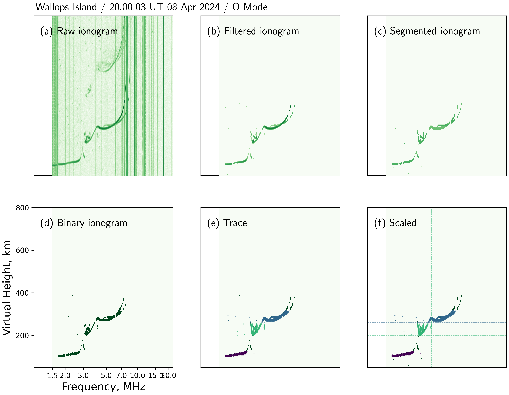

<!-- 
Author(s): Shibaji Chakraborty

Disclaimer:

-->
# AutoScale-ISCA: _Automatic Ionogram Scaler using Image Segmentation and Clustering Analysis_
`AutoScale-ISCA` is a **Machine Learing**-based (ML) tool within the Pynasonde framework designed for the automatic scaling of ionograms. Leveraging sophisticated image segmentation and clustering techniques, this tool reduces the need for manual intervention, delivering reliable and accurate extraction of ionospheric parameters. The tool employs methods like fuzzy K-means clustering, Otsu's thresholding, and DBSCAN (Density-Based Spatial Clustering of Applications with Noise), allowing researchers to process ionogram data more efficiently, especially during complex space weather events.

<figure markdown>

<figcaption>Figure 01: Illustration of the various stages of AutoScale-ISCA in action. The figure showcases the effectiveness of AutoScale-ISCA in processing ionograms. It presents the output from different stages of the tool applied to a vertical ionogram. The event occurred at 15:50:03 UT on April 4, 2024, and was related to the 2024 Great American Eclipse (GAE). The stages shown include: (a) Raw vertical ionogram, (b) Filtered ionogram (based on a frequency-noise profiler and expected virtual height), (c) Segmented ionogram using fuzzy K-means clustering, (d) Binary image created from the segmented part using Otsu's thresholding, (e) Traces identified using density-based clustering (DBSCAN), (f) Estimated parameters $fo_s$ (critical frequency) and $hm_s$ (layer height).
</figcaption>
</figure>

## Working of AutoScale-ISCA
The workflow of AutoScale-ISCA begins with raw ionogram data, which undergoes a series of stages to extract meaningful parameters:

* _Raw Ionogram (Figure 01a)_: This is the initial stage where ionospheric echoes are captured from a vertical ionogram. The raw data is usually noisy, making it difficult to immediately extract any meaningful parameters.

* _Filtered Ionogram (Figure 01b)_: To enhance the signal and eliminate unwanted noise, the raw ionogram is filtered using a frequency-noise profiler and constraints based on the expected virtual height of the ionosphere. This step prepares the data for segmentation by ensuring only the relevant ionospheric echoes are retained.

* _Segmentation Using Fuzzy K-means (Figure 01c)_: In this step, AutoScale-ISCA employs fuzzy K-means clustering to segment the ionogram. Unlike standard K-means, which assigns data points to distinct clusters, fuzzy K-means allows each data point to belong to multiple clusters with varying degrees of membership. This flexibility is particularly useful in dealing with the gradual transitions in ionospheric data. By clustering data based on similarity in frequency and virtual height, the ionospheric traces become more distinguishable, leading to clearer separation of key ionospheric structures.

* _Binary Image Conversion Using Otsu’s Threshold (Figure 01d)_: Once the ionogram has been segmented, Otsu’s thresholding technique is used to convert the segmented data into a binary image. This method automatically determines the optimal threshold value by minimizing the intra-class variance between the foreground and background, ensuring the segmented ionospheric traces are clearly separated from the remaining noise. This step refines the segmentation, making it easier to detect important features in the ionogram.

* _Trace Identification Using DBSCAN (Figure 01e)_: The final step of analysis involves the use of DBSCAN, a density-based clustering algorithm. DBSCAN is effective in identifying traces by clustering points based on their density, which is ideal for ionograms where traces can appear as dense clusters of points. DBSCAN can also handle outliers (noisy points that do not belong to any cluster) by treating them as noise, ensuring that only valid traces are considered. This step allows the tool to identify the key ionospheric parameters such as critical frequency and maximum electron density.

* _Parameter Estimation ($fo_s$ and $hm_s$, Figure 01f)_: The final output of AutoScale-ISCA is the estimation of critical ionospheric parameters like the critical frequency ($fo_s$) and maximum height ($hm_s$) of the ionospheric layers. These parameters are crucial for understanding ionospheric behavior during space weather events, such as the 2024 Great American Eclipse (GAE) event on April 4, 2024.

## Benefits of different ML techniques used in AutoScale-ISCA
* _Fuzzy K-means Clustering_: This technique enables flexible and nuanced clustering of ionogram data by allowing partial membership in multiple clusters. This is particularly beneficial for ionograms where boundaries between different ionospheric layers may not be sharp.

* _Otsu's Thresholding_: Automatically selects the optimal threshold to separate the ionospheric traces from the noise. This adaptive method ensures precise binary conversion, which is essential for subsequent analysis.

* _DBSCAN Clustering_: By identifying dense regions of data points, DBSCAN is particularly effective in isolating meaningful traces from noise. Its ability to detect outliers enhances the overall accuracy of the tool.

## Summarize the process
AutoScale-ISCA is a highly efficient tool that automates ionogram scaling using state-of-the-art image segmentation and clustering techniques. By combining fuzzy K-means, Otsu's thresholding, and DBSCAN, it provides a comprehensive and accurate method for extracting critical ionospheric parameters. This tool plays an essential role in space weather studies, allowing scientists to analyze complex ionospheric phenomena such as those associated with the 2024 Great American Eclipse.

