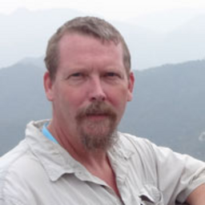

<!-- 
Author(s): Shibaji Chakraborty

Disclaimer:

-->

|  <b>Shibaji Chakraborty</b> Developer, contributed to data analysis and software development. Specializes in atmospheric, space physics, space weather, with extensive work in high-frequency (HF) radar systems and the SuperDARN network. |  <b>Justin Mabie</b> Developer, contributed to data analysis and software development. Focuses on instrumentation and data processing, and is an expert in the VIPIR ionosonde system. |
|---|---|
|  <b>Terry Bullett</b> Provided expertise in ionospheric physics and validation of scientific results. Renowned for his work with the VIPIR ionosonde and ionospheric remote sensing. |  <b>Aroh Barjatya</b> Advisor and collaborator. Expert in sensor design and calibration, and serves as the head of the Space and Atmospheric Instrumentation Lab (SAIL) and the Center for Space and Atmospheric Research (CSAR). |

<!-- |  <strong>Shibaji Chakraborty</strong>  Developer, contributed to data analysis and software development. Specializes in atmospheric, space physics, space weather, with extensive work in high-frequency (HF) radar systems and the SuperDARN network. |  <strong>Justin Mabie</strong>  Developer, contributed to data analysis and software development. Focuses on instrumentation and data processing, and is an expert in the VIPIR ionosonde system. |
|---|---|
|  **Terry Bullett** Provided expertise in ionospheric physics and validation of scientific results. Renowned for his work with the VIPIR ionosonde and ionospheric remote sensing. |  **Aroh Barjatya** Advisor and collaborator. Expert in sensor design and calibration, and serves as the head of the Space and Atmospheric Instrumentation Lab (SAIL) and the Center for Space and Atmospheric Research (CSAR). | -->

---

**Disclaimer:**  
This page credits the primary contributors to the project. For more details, refer to the project documentation.
